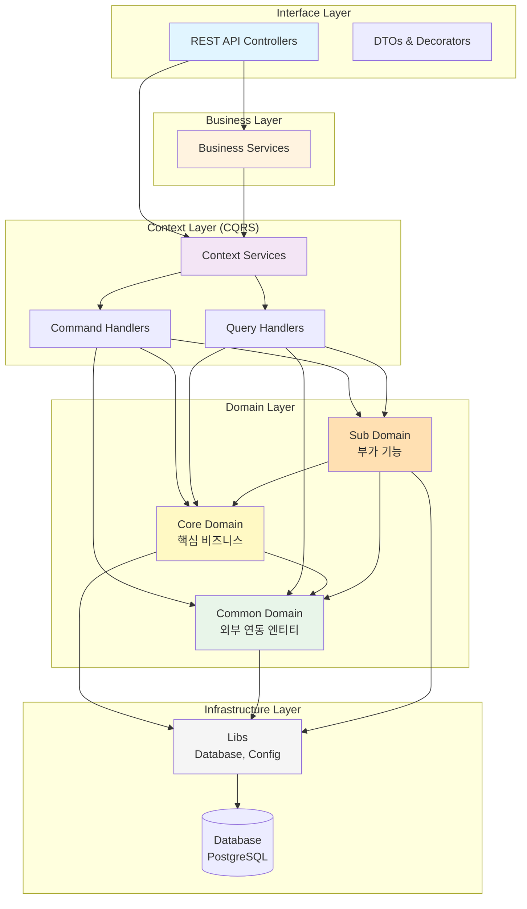

# 개인 재고·물품 관리 시스템 (Home Inventory Manager)

NestJS + TypeORM 기반의 개인/가족 재고 관리 백엔드 프로젝트  
목적: NestJS 기본 → 중급 개념 실전 연습 + 실생활에서 매일/매주 쓸 수 있는 유용한 서비스 만들기

현재 날짜 기준 목표  
- 2026년 상반기 중 기본 기능 완성  
- 실제 가족/본인 집에서 3개월 이상 사용해 보기

## 1. 프로젝트 개요

### 핵심 가치
- 식료품, 세제, 화장품, 의약품 등 **소모성 품목**의 잔량·유통기한 관리
- **전자제품, 식기류, 침대·책상 등 가구** 등 비소모 품목도 등록·관리
- **현재 잔고**(현금, 통장)와 **예정된 월급날** 등 수입 데이터 등록·관리
- 구매 이력 추적 → 단가 변동 파악
- 소비 패턴 분석 → 낭비 줄이기
- 유통기한 임박 자동 알림
- 장보기 리스트 자동/수동 생성 지원

### 타겟 사용자
- 1인 또는 소규모 **가족/공유 그룹** ~ 4인 가족
- 재료 낭비를 줄이고 싶거나, 예산 관리를 조금 더 체계적으로 하고 싶은 사람

## 2. 아키텍처

### 레이어드 아키텍처



### 의존성 규칙

```
Interface → Business → Context → Domain → Infrastructure
    ↓          ↓          ↓          ↓
   DTO      조합 로직   CQRS      엔티티      Database
```

**도메인 간 의존성:**

- ✅ Core Domain → Common Domain
- ✅ Sub Domain → Core Domain, Common Domain
- ❌ Common Domain → Core/Sub Domain

### 레이어별 책임

#### Domain Layer (`src/domain/`)
- 비즈니스 엔티티 및 도메인 로직
- TypeORM 엔티티 정의
- Domain Service (Repository 패턴)
- **도메인 분류**: Common → Core → Sub (단방향 의존성)

#### Context Layer (`src/context/`)
- CQRS 패턴 구현 (Command/Query 분리)
- Command Handlers: 상태 변경 (Create, Update, Delete)
- Query Handlers: 조회 (Get, List, Search)
- Job Handlers: 배치 작업 및 스케줄러
- 트랜잭션 관리

#### Business Layer (`src/business/`)
- 여러 Context 오케스트레이션
- 외부 시스템 연동 (SSO, DART 등)
- 복잡한 비즈니스 로직 조합
- 보상 트랜잭션 처리

#### Interface Layer (`src/interface/`)
- REST API Controllers
- DTO 정의 및 검증 (class-validator)
- Swagger 문서화
- Auth Guards 및 Decorators
- Exception Filters

## 3. 기술 스택 (2026년 기준 추천)

| 항목              | 선택 기술                        | 비고                                      |
|-------------------|----------------------------------|-------------------------------------------|
| 언어/프레임워크    | TypeScript + NestJS 10+          | —                                         |
| ORM               | TypeORM                          | PostgreSQL driver 추천                    |
| 데이터베이스      | PostgreSQL 16+                   | 로컬 or Supabase or Railway 무료 티어     |
| 인증              | @nestjs/passport + JWT           | refresh token 고려                        |
| 유효성 검사       | class-validator + class-transformer | —                                      |
| 설정 관리         | @nestjs/config                   | .env + validation                         |
| 로깅              | nestjs pino or winston           | —                                         |
| 스케줄러          | @nestjs/schedule                 | 만료 체크, 주간 리포트 등                 |
| API 문서          | Swagger (@nestjs/swagger)        | —                                         |
| 테스트            | Jest                             | e2e 테스트 최소 40% 목표                  |
| 배포              | Docker + Railway / Render / Fly.io | —                                      |

## 4. 도메인 & 엔티티 설계

**상세 ER·관계도·Mermaid 다이어그램:** [docs/er-diagram.md](./docs/er-diagram.md)  
**개념적 설계(엔티티·속성만):** [docs/entity-conceptual-design.md](./docs/entity-conceptual-design.md)  
**논리적 설계(PK·FK·타입):** [docs/entity-logical-design.md](./docs/entity-logical-design.md)

| 순번 | 엔티티                  | 핵심 역할                                      | 주요 관계                       | 우선순위 |
|------|-------------------------|------------------------------------------------|----------------------------------|----------|
| 1    | User                    | 사용자 계정                                    | —                                | ★★★★★    |
| 2    | Household               | 가족·공유 그룹                                 | User ↔ ManyToMany                | ★★★★     |
| 3    | Category                | 대분류 (식료품, 생활용품, 의약품, 전자제품, 식기류, 가구류…) | — (계층형 가능)                  | ★★★★★    |
| 4    | StorageLocation         | 보관 장소 (냉장고 문쪽, 선반 2단, 욕실장...)   | Household                        | ★★★★     |
| 5    | Unit                    | 단위 마스터 (ml, g, 개, 병, 팩...)             | —                                | ★★★      |
| 6    | Product                 | 상품 마스터 (소모품·비소모품: 식료품, 전자제품, 가구 등)    | Category                         | ★★★★★    |
| 7    | ProductVariant          | 용량/포장 단위별 정보                          | Product                          | ★★★★     |
| 8    | InventoryItem           | 실제 보유 재고                                 | ProductVariant, StorageLocation  | ★★★★★    |
| 9    | Purchase                | 구매 기록                                      | InventoryItem                    | ★★★★     |
| 10   | PurchaseBatch           | 로트별 유통기한 정보                           | Purchase                         | ★★★★     |
| 11   | Consumption             | 소비/사용 기록                                 | InventoryItem                    | ★★★★     |
| 12   | InventoryLog            | 재고 변경 이력 (입고/소비/조정/폐기)           | InventoryItem                    | ★★★      |
| 13   | WasteRecord             | 폐기 기록 (유통기한 만료, 변질 등)             | InventoryItem                    | ★★★      |
| 14   | ShoppingList            | 장보기 리스트                                  | Household                        | ★★★★     |
| 15   | ShoppingListItem        | 리스트 항목(카테고리 필수, 품목·Variant·재고 출처는 힌트) | ShoppingList, Category, (선택) Product/Variant/InventoryItem | ★★★★ |
| 16   | Notification            | 알림 (만료 임박, 잔량 부족 등)                | User                             | ★★★★     |
| 17   | ExpirationAlertRule     | 만료 알림 설정 (품목별 며칠 전 알림)           | User or Household, Product       | ★★★      |
| 18   | ReportPreset            | 자주 보는 리포트 설정 저장                     | User                             | ★★       |
| 19   | Account                 | 잔고 (현금, 통장 등)                           | User 또는 Household              | ★★★      |
| 20   | RecurringIncome         | 예정 수입 (월급날, 금액 등)                    | User 또는 Household              | ★★★      |

**추가 구현 대상**  
Recipe, Brand, Supplier, Photo(영수증/제품사진), Integration(카카오톡 알림 등) — [추가로 고려할 기능](./docs/considerations.md) 참고.

## 5. 기능 로드맵 (단계별)

### Phase 1 – 기반 다지기 (1~3주)
- 프로젝트 생성 & 환경설정
- User + Auth (JWT)
- Category + StorageLocation + Unit CRUD
- Product + ProductVariant CRUD

### Phase 2 – 핵심 재고 관리 (3~6주)
- InventoryItem 생성/조회/수정
- Purchase → 재고 증가 (+ 트랜잭션)
- Consumption → 재고 감소 (+ 트랜잭션)
- InventoryLog 기록(구매·소비·폐기·조정 시 트랜잭션과 함께 명시적 기록; 별도 배치 자동 동기화 없음)

### Phase 3 – 유통기한 & 알림 (6~9주)
- PurchaseBatch + expirationDate 관리
- @Cron 만료 체크 → Notification 생성
- 잔량 부족 알림 룰

### Phase 4 – 장보기 & 편의 기능 (9~12주)
- ShoppingList + ShoppingListItem
- “자동 추가” 기능 (minStockLevel 이하 품목)
- 간단 통계 API (지난 30일 소비 TOP 10, 카테고리별 지출 등)

### Phase 5 – 마무리 & 개선 (12주 이후)
- Swagger 문서 정리
- 에러 핸들링 강화 (Exception Filter)
- Docker + CI/CD 기본 세팅
- 실제 데이터 입력 후 1개월 사용 피드백 반영

## 6. 중요 구현 포인트 & NestJS 학습 체크리스트

- [ ] 모듈 분리 (domain-driven 느낌으로)
- [ ] TypeORM 관계 매핑 (cascade, eager/lazy)
- [ ] 트랜잭션 처리 (@Transaction() 또는 QueryRunner)
- [ ] Custom Guard (소유권 체크 – 가족/공유 그룹 멤버만 접근)
- [ ] ValidationPipe global + custom pipe
- [ ] @Cron + @nestjs/schedule
- [ ] Interceptor (로깅, 응답 포맷 통일)
- [ ] Exception Filter (재고 부족, 만료 오류 등 도메인 에러)
- [ ] Pagination + Filtering + Searching (Query builder 활용)
- [ ] File upload (영수증 사진) – Multer + local/S3

## 7. 개발 규칙 (자기 약속)

1. 엔티티 하나 추가할 때마다 **ERD 그림** 업데이트 (draw.io 추천)
2. API 하나 만들 때마다 **Swagger 설명 + 예시** 작성
3. 핵심 비즈니스 로직(재고 증감)은 **서비스 계층**에서 트랜잭션 단위로 관리
4. 매주 금요일 → 그 주에 구현한 기능 실제 데이터로 테스트
5. README.md 또는 docs 폴더에 진행 상황 기록

## 8. 다음 액션 아이템 (바로 할 수 있는 것)

- [ ] nest new home-inventory --package-manager npm
- [ ] .env.example + .gitignore 세팅
- [ ] User 엔티티 + Auth 모듈 생성
- [ ] PostgreSQL docker-compose.yml 작성
- [ ] Category 엔티티부터 하나씩 만들기 시작

---

**화이팅입니다 창욱님!**  
필요할 때마다 특정 부분(엔티티 관계 코드, 트랜잭션 예제, Cron 로직 등) 더 자세히 요청 주세요.  
천천히, 그러나 꾸준히 가봅시다 💪
