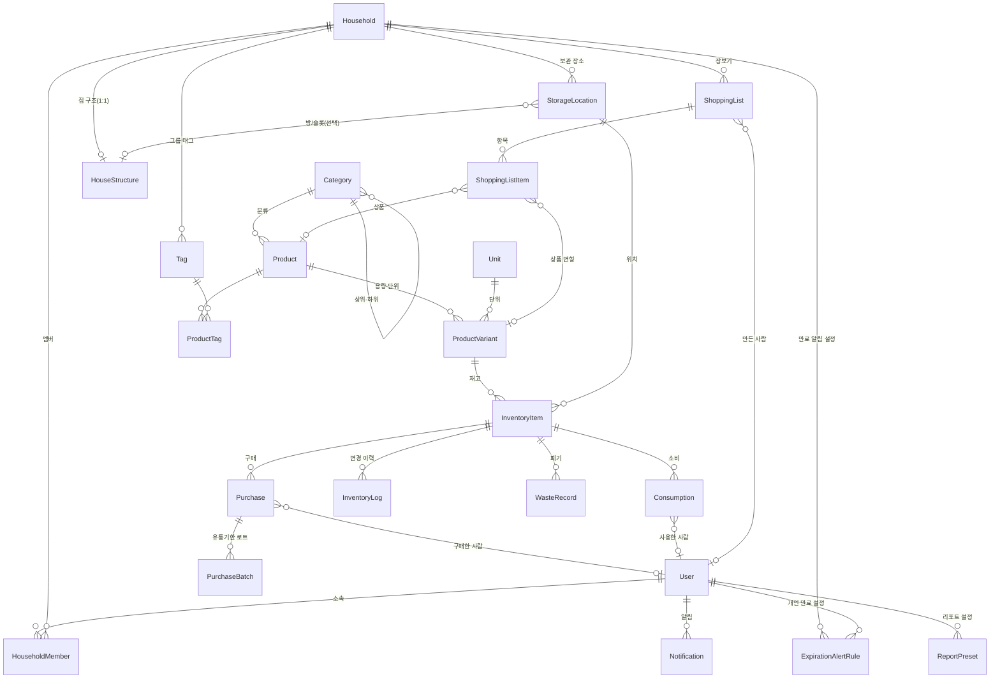

# 개념적 설계 — 엔티티와 속성

**목적**: 비즈니스 관점에서 **엔티티 이름**과 **필요한 속성**만 정리합니다.  
식별자(PK), 외래키(FK), 데이터 타입은 다루지 않습니다.

**다음 단계**: 속성의 제약·타입·식별·관계는 [엔티티 논리적 설계](./entity-logical-design.md)에서 다룹니다.

---

## 개념적 ERD (엔티티 간 관계)

> PK/FK 없이 **어떤 엔티티가 무엇과 연결되는지**만 표현합니다.

---

## User (사용자)

- 이메일
- 비밀번호(인증용 저장값)
- 표시 이름
- 마지막 로그인 시각

---

## Household (가족·공유 그룹)

- 그룹 이름
- 초대 코드

---

## HouseholdMember (가족·공유 그룹 멤버십)

- 사용자
- 가족·공유 그룹
- 역할(소유자, 멤버 등)
- 가입 시각

---

## Category (카테고리)

- 이름
- 상위 카테고리(계층용, 선택)
- 정렬 순서

---

## HouseStructure (집 구조)

- 소속 가족·공유 그룹 (Household 1:1)
- 구조 이름 (예: "우리 집")
- 구조 데이터 (방·슬롯 정의, JSONB)
- (선택) 스키마 버전

→ 상세: [집 구조도 백엔드 명세](./house-structure-3d-feature.md)

---

## StorageLocation (보관 장소)

- 소속 가족·공유 그룹
- 장소 이름
- 정렬 순서
- (선택) 집 구조 내 방/슬롯 연결 — HouseStructure + roomId 또는 slotId

---

## Unit (단위)

- 단위 기호(예: ml, g, 개)
- 표시 이름
- 정렬 순서

---

## Product (상품)

- 카테고리
- 상품 이름
- 바코드
- 설명
- 소모품 여부(전자제품·가구 등 비소모품 구분)

---

## ProductVariant (상품 용량·포장 단위)

- 상품
- 단위
- 단위당 수량(예: 1팩당 6개)
- 표시용 이름
- SKU
- 대표 용량 여부

---

## InventoryItem (재고 품목)

- 상품 변형
- 보관 장소
- 현재 수량
- 최소 재고 기준(잔량 부족 알림용)

---

## Purchase (구매 기록)

- 재고 품목
- 구매 수량
- 구매 일시
- 단가
- 총액
- 메모
- 구매 수행 사용자(선택)
- 구매처 이름(선택)

---

## PurchaseBatch (유통기한 로트)

- 구매 기록
- 로트 수량
- 유통기한
- 제조·로트 코드(선택)

---

## Consumption (소비 기록)

- 재고 품목
- 소비 수량
- 사용 일시
- 메모
- 사용한 사용자(선택)
- 연결 레시피(선택)

---

## InventoryLog (재고 변경 이력)

- 재고 품목
- 변경 유형(입고, 출고, 조정, 폐기 등)
- 수량 변화
- 변경 후 수량
- 관련 기록 참조(어떤 구매·소비·폐기와 연결됐는지)
- 발생 시각
- 메모

---

## WasteRecord (폐기 기록)

- 재고 품목
- 폐기 수량
- 사유
- 폐기 일시
- 메모

---

## ShoppingList (장보기 리스트)

- 가족·공유 그룹
- 리스트 이름
- 상태
- 마감(예정)일
- 만든 사용자(선택)

---

## ShoppingListItem (장보기 항목)

- 장보기 리스트
- 상품 또는 상품 변형
- 수량
- 정렬 순서
- 체크(구매 완료) 여부
- 메모

---

## Notification (알림)

- 수신 사용자
- 알림 유형
- 제목
- 본문
- 읽은 시각
- 관련 대상 참조(어떤 품목·로트 등과 연결되는지)
- 알림 채널(선택)

---

## ExpirationAlertRule (만료 알림 설정)

- 소유 주체(사용자 또는 가족·공유 그룹)
- 유통기한 며칠 전 알림
- 활성 여부

---

## Tag (태그)

- 이름
- 색상(선택)
- 소속 가족·공유 그룹(선택)

---

## ProductTag (상품–태그 연결)

- 상품
- 태그

---

## ReportPreset (리포트 설정)

- 사용자
- 설정 이름
- 설정 내용(필터, 기간 등)
- 정렬 순서

---

## 개념적 설계 메모

- **로트**: 한 번에 구매한 같은 품목 묶음, 같은 유통기한 단위. PurchaseBatch가 이를 표현합니다.
- **가족·공유 그룹(Household)** 과 **가구(침대·책상)** 는 다릅니다. 후자는 Product·Category(가구류)로 관리합니다.
### 기타 추가 예정(참고)

[policy/considerations.md](./policy/considerations.md)에 정리된 기능·엔티티 후보: **Recipe**, **Brand**, **Supplier**, **Photo**, **Integration**(알림 채널), **AuditLog**(활동 로그) 등. 필요 시 개념/논리 설계에 순차 반영. (가계부·구독·예산은 별도 프로젝트 권장.)
