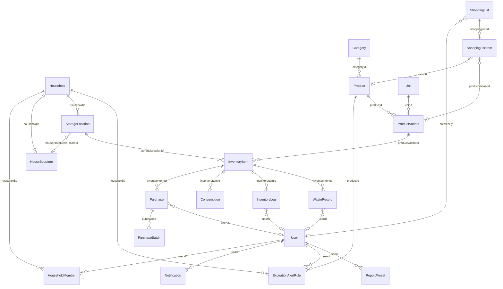
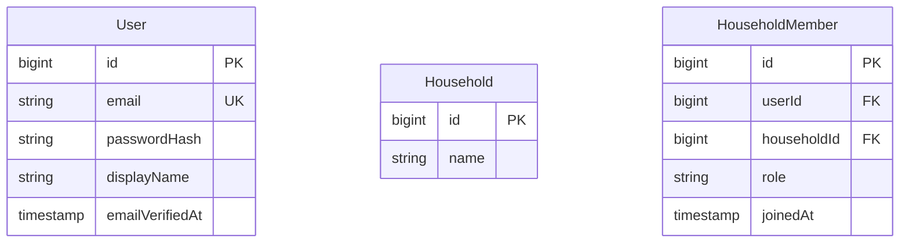
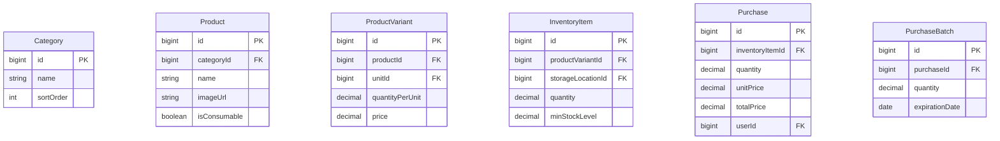
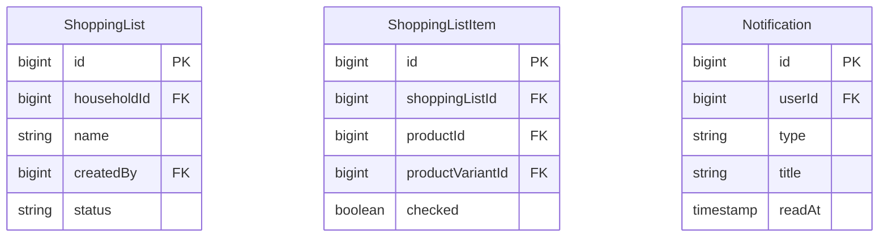

# 엔티티 논리적 설계 (ERD·구현용)

**역할**: 개념적 설계를 바탕으로 **필드 단위**로 정리합니다.  
식별자(PK), 외래키(FK), 타입, 제약, 관계를 명시합니다.

**상위 문서**: [개념적 설계 — 엔티티와 속성](./entity-conceptual-design.md)

ERD를 그리면서 **추가할 것·줄일 것**을 검토하기 위한 엔티티별 필드·관계 정리입니다.

---

## 논리적 ERD — 엔티티 관계 (카디널리티)

> 구현 시 FK·테이블명은 TypeORM 기준으로 조정 가능합니다.

---

## 논리적 ERD — 주요 엔티티 속성 (PK·FK)

### 인증·가족·공유 그룹

### 마스터·재고

### 장보기·알림

- **ExpirationAlertRule**: `productId`는 **필수**(품목별 일수). `userId`와 `householdId`는 **둘 중 하나만** 채우는 정책(개인 vs 가족·공유 그룹 소유). **동일 소유 주체·동일 품목**에 규칙은 **한 행만** (아래 중복 방지 제약).
- **ShoppingListItem**: `productId`와 `productVariantId`는 정책에 따라 **하나만** 필수로 둘 수 있음.

---

## 1. User (사용자)

| 구분     | 항목                 | 타입/비고            | 검토                                       |
| -------- | -------------------- | -------------------- | ------------------------------------------ |
| **필수** | id                   | PK, UUID 또는 bigint | —                                          |
| **필수** | email                | string, unique       | —                                          |
| **필수** | passwordHash         | string (bcrypt 등)   | —                                          |
| **선택** | displayName          | string               | 닉네임/표시 이름                           |
| **선택** | emailVerifiedAt      | timestamp, nullable  | 이메일 인증 완료 시각; **NULL이면 미인증** |
| **선택** | createdAt, updatedAt | timestamp            | 감사용                                     |
| **선택** | lastLoginAt          | timestamp            | —                                          |

**관계**: Household (N:N), Notification (1:N), ExpirationAlertRule (1:N), ReportPreset (1:N), ShoppingList (1:N, `createdBy`), Purchase·InventoryLog·WasteRecord (선택 `userId`)

**이메일 검증**: 가입 시 인증 메일 발송 → 토큰(또는 링크) 검증 후 `emailVerifiedAt` 설정. 토큰 저장·만료는 별도 테이블 또는 캐시로 구현 가능.

---

## 2. Household (가족/공유 그룹)

| 구분     | 항목                 | 타입/비고 | 검토                                        |
| -------- | -------------------- | --------- | ------------------------------------------- |
| **필수** | id                   | PK        | —                                           |
| **필수** | name                 | string    | "우리 가족", "1인" 등 (가족·공유 그룹 이름) |
| **선택** | createdAt, updatedAt | timestamp | —                                           |

**관계**: User (N:N, 연관 테이블 HouseholdMember), StorageLocation (1:N), ShoppingList (1:N), ExpirationAlertRule (1:N, 선택)

**연관 테이블 HouseholdMember** (User–Household N:N)  
| 구분 | 항목 | 비고 |
|------|------|------|
| 필수 | userId, householdId | 복합 PK 또는 PK + unique |
| 선택 | role | 'owner' \| 'member' |
| 선택 | joinedAt | timestamp |

**추가 검토**: `currency`(통화), `timezone`, `maxMembers`

---

## 3. Category (대분류)

| 구분     | 항목                 | 타입/비고 | 검토                                                              |
| -------- | -------------------- | --------- | ----------------------------------------------------------------- |
| **필수** | id                   | PK        | —                                                                 |
| **필수** | name                 | string    | "식료품", "생활용품", "의약품", "전자제품", "식기류", "가구류" 등 |
| **선택** | sortOrder            | int       | 표시 순서                                                         |
| **선택** | createdAt, updatedAt | timestamp | —                                                                 |

**관계**: Product (1:N) — **플랫(1단계) 카테고리만** 사용, 계층(parent) 없음.

---

## 4. HouseStructure (집 구조)

| 구분     | 항목                 | 타입/비고              | 검토                          |
| -------- | -------------------- | ---------------------- | ----------------------------- |
| **필수** | id                   | PK                     | —                             |
| **필수** | householdId          | FK → Household, unique | Household당 1개               |
| **필수** | name                 | string                 | "우리 집" 등                  |
| **필수** | structurePayload     | jsonb                  | 방·슬롯 정의(rooms, slots 등) |
| **선택** | version              | int                    | 스키마 버전                   |
| **선택** | createdAt, updatedAt | timestamp              | —                             |

**관계**: Household (1:1), StorageLocation(선택: roomId로 방 연결)

→ API·스키마 상세: [house-structure-3d-feature.md](./house-structure-3d-feature.md)

---

## 5. StorageLocation (보관 장소)

| 구분     | 항목                 | 타입/비고                     | 검토                                |
| -------- | -------------------- | ----------------------------- | ----------------------------------- |
| **필수** | id                   | PK                            | —                                   |
| **필수** | householdId          | FK → Household                | —                                   |
| **필수** | name                 | string                        | "냉장고 문쪽", "선반 2단", "욕실장" |
| **선택** | houseStructureId     | FK → HouseStructure, nullable | 집 구조 내 방과 연결 시             |
| **선택** | roomId               | string, nullable              | structurePayload 내 room id         |
| **선택** | sortOrder            | int                           | —                                   |
| **선택** | createdAt, updatedAt | timestamp                     | —                                   |

**관계**: Household (N:1), HouseStructure (선택 N:1), InventoryItem (1:N)

---

## 6. Unit (단위 마스터)

| 구분     | 항목      | 타입/비고      | 검토                        |
| -------- | --------- | -------------- | --------------------------- |
| **필수** | id        | PK             | —                           |
| **필수** | symbol    | string, unique | "ml", "g", "개", "병", "팩" |
| **선택** | name      | string         | "밀리리터", "그램"          |
| **선택** | sortOrder | int            | —                           |

**관계**: ProductVariant (N:1, 단위 참조)

---

## 7. Product (상품 마스터)

| 구분     | 항목                 | 타입/비고        | 검토                                                                                                      |
| -------- | -------------------- | ---------------- | --------------------------------------------------------------------------------------------------------- |
| **필수** | id                   | PK               | —                                                                                                         |
| **필수** | categoryId           | FK → Category    | —                                                                                                         |
| **필수** | name                 | string           | 상품명                                                                                                    |
| **필수** | isConsumable         | boolean          | **true**: 소비형(음식, 생필품 등 소모·소비) / **false**: 사용형(후라이팬, 식기세척기 등 비소모·장기 사용) |
| **선택** | imageUrl             | string, nullable | 상품 이미지 URL(또는 스토리지 키)                                                                         |
| **선택** | description          | text, nullable   | —                                                                                                         |
| **선택** | createdAt, updatedAt | timestamp        | —                                                                                                         |

**관계**: Category (N:1), ProductVariant (1:N), ExpirationAlertRule (1:N), ShoppingListItem (참조 가능)

**비고**: 바코드는 수집하지 않음.

---

## 8. ProductVariant (용량/포장 단위별 정보)

| 구분     | 항목                 | 타입/비고         | 검토                         |
| -------- | -------------------- | ----------------- | ---------------------------- | ------------------ | ---------------- |
| **필수** | id                   | PK                | —                            |
| **필수** | productId            | FK → Product      | —                            |
| **필수** | unitId               | FK → Unit         | —                            |
| **필수** | quantityPerUnit      | decimal           | 1팩=6개 → 6, 1병=500ml → 500 |
| **선택** | name                 | string            | "500ml", "1팩(6개)" (표시용) |
| **선택** | price                | decimal, nullable | 참고 단가(표시·장보기 등)    |
| **선택** | sku                  | string, nullable  | —                            | Stock Keeping Unit | (재고 관리 단위) |
| **선택** | isDefault            | boolean           | 대표 용량 여부               |
| **선택** | createdAt, updatedAt | timestamp         | —                            |

**관계**: Product (N:1), Unit (N:1), InventoryItem (1:N), ShoppingListItem (참조 가능)

**비고**: 바코드는 사용하지 않음.

---

## 9. InventoryItem (실제 보유 재고)

| 구분     | 항목                 | 타입/비고            | 검토                                               |
| -------- | -------------------- | -------------------- | -------------------------------------------------- |
| **필수** | id                   | PK                   | —                                                  |
| **필수** | productVariantId     | FK → ProductVariant  | —                                                  |
| **필수** | storageLocationId    | FK → StorageLocation | —                                                  |
| **필수** | quantity             | decimal              | 현재 수량                                          |
| **선택** | minStockLevel        | decimal, nullable    | **잔량 부족 알림** 기준; NULL이면 해당 알림 미사용 |
| **선택** | createdAt, updatedAt | timestamp            | —                                                  |

**관계**: ProductVariant (N:1), StorageLocation (N:1), Purchase (1:N), Consumption (1:N), InventoryLog (1:N), WasteRecord (1:N)

**추가 검토**: `householdId`(조회 편의용 중복), `unitId`(variant에서 가져올 수 있음)

---

## 10. Purchase (구매 기록)

| 구분     | 항목            | 타입/비고           | 검토                                      |
| -------- | --------------- | ------------------- | ----------------------------------------- |
| **필수** | id              | PK                  | —                                         |
| **필수** | inventoryItemId | FK → InventoryItem  | —                                         |
| **필수** | quantity        | decimal             | 구매 수량                                 |
| **필수** | unitPrice       | decimal             | **구매 시점 단가** (통계·가격 이력용)     |
| **필수** | totalPrice      | decimal             | **구매 시점 총액** (통계·가격 이력용)     |
| **선택** | purchasedAt     | timestamp           | 구매일 (기본 now)                         |
| **선택** | memo            | string, nullable    | —                                         |
| **선택** | userId          | FK → User, nullable | **누가 구매했는지** (가구 내 구매자 기록) |
| **선택** | createdAt       | timestamp           | —                                         |

**관계**: InventoryItem (N:1), PurchaseBatch (1:N), User (선택 N:1)

**추가 검토**: 매장명·결제수단 등은 본 설계 범위에서 제외

---

## 11. PurchaseBatch (유통기한 로트)

> **로트(lot)**: 한 번에 구매한 같은 품목 묶음. 같은 유통기한을 공유하는 단위.  
> 예: 우유 2팩을 3월 1일에 구매하고 유통기한이 3월 10일이면, 그 2팩이 한 로트.

| 구분     | 항목           | 타입/비고     | 검토         |
| -------- | -------------- | ------------- | ------------ |
| **필수** | id             | PK            | —            |
| **필수** | purchaseId     | FK → Purchase | —            |
| **필수** | quantity       | decimal       | 이 로트 수량 |
| **필수** | expirationDate | date          | 유통기한     |
| **선택** | createdAt      | timestamp     | —            |

**관계**: Purchase (N:1)

---

## 12. Consumption (소비/사용 기록)

| 구분     | 항목            | 타입/비고          | 검토              |
| -------- | --------------- | ------------------ | ----------------- |
| **필수** | id              | PK                 | —                 |
| **필수** | inventoryItemId | FK → InventoryItem | —                 |
| **필수** | quantity        | decimal            | 소비 수량         |
| **선택** | consumedAt      | timestamp          | 사용일 (기본 now) |
| **선택** | memo            | string, nullable   | —                 |
| **선택** | createdAt       | timestamp          | —                 |

**관계**: InventoryItem (N:1)

---

## 13. InventoryLog (재고 변경 이력)

| 구분     | 항목            | 타입/비고           | 검토                                         |
| -------- | --------------- | ------------------- | -------------------------------------------- |
| **필수** | id              | PK                  | —                                            |
| **필수** | inventoryItemId | FK → InventoryItem  | —                                            |
| **필수** | type            | enum                | 'in' \| 'out' \| 'adjust' \| 'waste'         |
| **필수** | quantityDelta   | decimal             | + 증가, - 감소                               |
| **필수** | quantityAfter   | decimal             | 변경 후 수량 (스냅샷)                        |
| **선택** | userId          | FK → User, nullable | **누가 변경했는지** (수동 조정·직접 입력 등) |
| **선택** | memo            | string, nullable    | 변경 사유·메모                               |
| **선택** | refType, refId  | string, nullable    | Purchase/Consumption/WasteRecord 등 참조     |
| **선택** | createdAt       | timestamp           | —                                            |

**관계**: InventoryItem (N:1), User (선택 N:1)

**비고**: **재고 자동 변경(배치·트리거 동기화 등)는 없음.** 이력은 사용자가 앱에서 수행한 구매·소비·폐기·수량 수정 등에 대해 **명시적으로 기록**합니다.

---

## 14. WasteRecord (폐기 기록)

| 구분     | 항목            | 타입/비고           | 검토                                                                                                      |
| -------- | --------------- | ------------------- | --------------------------------------------------------------------------------------------------------- |
| **필수** | id              | PK                  | —                                                                                                         |
| **필수** | inventoryItemId | FK → InventoryItem  | —                                                                                                         |
| **필수** | quantity        | decimal             | 폐기 수량                                                                                                 |
| **선택** | userId          | FK → User, nullable | **누가 폐기했는지**                                                                                       |
| **선택** | reason          | string, nullable    | **자유 입력**. 앱에서는 `expired` / `damaged` / `other`를 선택해 넣거나, 필요 시 추가 문구를 붙일 수 있음 |
| **선택** | wastedAt        | timestamp           | —                                                                                                         |
| **선택** | memo            | string, nullable    | —                                                                                                         |
| **선택** | createdAt       | timestamp           | —                                                                                                         |

**관계**: InventoryItem (N:1), User (선택 N:1)

---

## 15. ShoppingList (장보기 리스트)

| 구분     | 항목                 | 타입/비고           | 검토                                                                   |
| -------- | -------------------- | ------------------- | ---------------------------------------------------------------------- |
| **필수** | id                   | PK                  | —                                                                      |
| **필수** | householdId          | FK → Household      | —                                                                      |
| **필수** | name                 | string              | "이번 주 장보기", "주말 마트"                                          |
| **선택** | createdBy            | FK → User, nullable | **리스트 생성자**                                                      |
| **선택** | status               | string, nullable    | **자유 문자열**. 앱에서는 `draft` / `active` / `done` 등으로 선택·저장 |
| **선택** | dueDate              | date, nullable      | —                                                                      |
| **선택** | createdAt, updatedAt | timestamp           | —                                                                      |

**관계**: Household (N:1), ShoppingListItem (1:N), User (선택 N:1, createdBy)

**줄일 것**: status 없이 단일 "현재 리스트"만 써도 됨

---

## 16. ShoppingListItem (리스트 항목)

| 구분          | 항목                                | 타입/비고         | 검토           |
| ------------- | ----------------------------------- | ----------------- | -------------- |
| **필수**      | id                                  | PK                | —              |
| **필수**      | shoppingListId                      | FK → ShoppingList | —              |
| **필수(택1)** | productId **또는** productVariantId | FK                | 정책 확정 필요 |
| **선택**      | quantity                            | decimal           | 1 이상         |
| **선택**      | sortOrder                           | int               | —              |
| **선택**      | checked                             | boolean           | 체크 여부      |
| **선택**      | memo                                | string, nullable  | —              |
| **선택**      | createdAt, updatedAt                | timestamp         | —              |

**관계**: ShoppingList (N:1), Product 또는 ProductVariant (N:1, 택1)

**추가 검토**: productId만 쓰고 수량/단위는 텍스트(memo)로 → 구조 단순화  
**줄일 것**: Product만 참조하고 "수량/단위"는 memo로 처리하면 ProductVariant 불필요

---

## 17. Notification (알림)

| 구분     | 항목           | 타입/비고           | 검토                                             |
| -------- | -------------- | ------------------- | ------------------------------------------------ |
| **필수** | id             | PK                  | —                                                |
| **필수** | userId         | FK → User           | —                                                |
| **필수** | type           | enum                | 'expiration_soon' \| 'low_stock' \| 'expired' 등 |
| **필수** | title          | string              | —                                                |
| **선택** | body           | text, nullable      | —                                                |
| **선택** | readAt         | timestamp, nullable | 읽음 여부                                        |
| **선택** | refType, refId | string, nullable    | InventoryItem, PurchaseBatch 등                  |
| **선택** | createdAt      | timestamp           | —                                                |

**관계**: User (N:1)

**비고**: 기본 채널은 **모바일 앱 푸시(로컬/FCM 등)** 로 가정; 별도 `channel` 컬럼은 두지 않음.

---

## 18. ExpirationAlertRule (만료 알림 설정)

| 구분          | 항목                        | 타입/비고      | 검토                                                |
| ------------- | --------------------------- | -------------- | --------------------------------------------------- |
| **필수**      | id                          | PK             | —                                                   |
| **필수**      | productId                   | FK → Product   | **품목(마스터)별**로 며칠 전에 알릴지 구분          |
| **필수(택1)** | userId **또는** householdId | FK 점유 한쪽만 | 개인·가족·공유 그룹 소유 구역(어느 맥락의 설정인지) |
| **필수**      | daysBefore                  | int            | 해당 품목: 유통기한 **N일 전** 알림                 |
| **선택**      | isActive                    | boolean        | 기본 true                                           |
| **선택**      | createdAt, updatedAt        | timestamp      | —                                                   |

**관계**: Product (N:1), User (N:1, 선택) 또는 Household (N:1, 선택)

### 중복 규칙 방지 (필수 수준으로 구현 권장)

1. **소유 주체 정합성 (CHECK)**  
   - `userId`와 `householdId`는 **정확히 하나만** NOT NULL이어야 함 (둘 다 NULL 또는 둘 다 NOT NULL 금지).

2. **가족·공유 그룹 단위 규칙**  
   - `householdId`가 채워진 행에 대해 **`(productId, householdId)` 조합은 유일**해야 함.  
   - 구현 예(PostgreSQL 등): 부분 유니크 인덱스  
     `UNIQUE (product_id, household_id) WHERE household_id IS NOT NULL AND user_id IS NULL`  
   - 의미: 같은 Household 안에서 **동일 Product**에 대한 만료 알림 규칙은 **최대 1건** (`daysBefore`는 그 한 행으로만 표현).

3. **개인 단위 규칙**  
   - `userId`가 채워진 행에 대해 **`(productId, userId)` 조합은 유일**해야 함.  
   - 구현 예:  
     `UNIQUE (product_id, user_id) WHERE user_id IS NOT NULL AND household_id IS NULL`  
   - 의미: 같은 사용자(개인 맥락)에 대해 **동일 Product** 규칙은 **최대 1건**.

4. **API·앱**  
   - 위 유니크 제약 위반 시 **409 Conflict**(또는 도메인 에러)로 거절.  
   - 또는 **같은 조합이면 UPDATE**만 허용하는 UPSERT(일수·활성만 갱신)를 택할 수 있음.

**비고**: 한 품목에 대해 Household 규칙과 동일 멤버의 User 규칙을 **동시에** 두면 알림이 이중일 수 있으므로, UI에서는 **가족 공유 vs 개인** 중 한 축만 쓰도록 안내하는 것을 권장.

---

## 19. ReportPreset (리포트 설정 저장)

| 구분     | 항목                 | 타입/비고 | 검토                |
| -------- | -------------------- | --------- | ------------------- |
| **필수** | id                   | PK        | —                   |
| **필수** | userId               | FK → User | —                   |
| **필수** | name                 | string    | "지난 30일 TOP10"   |
| **선택** | config               | jsonb     | 필터, 기간, 정렬 등 |
| **선택** | sortOrder            | int       | —                   |
| **선택** | createdAt, updatedAt | timestamp | —                   |

**관계**: User (N:1)

**추가 검토**: config 스키마 버전 관리  
**줄일 것**: 필요 시 추가 (우선순위 낮음)

---

## 요약: ERD 그릴 때 체크 포인트

| 구분              | 내용                                                                                                                                                                                                                  |
| ----------------- | --------------------------------------------------------------------------------------------------------------------------------------------------------------------------------------------------------------------- |
| **추가 검토**     | HouseholdMember 역할(owner/member), Purchase의 userId(구매자), InventoryLog의 userId·memo, ShoppingListItem의 Product vs ProductVariant 정책, Notification refType/refId, ExpirationAlertRule 품목별 일수·unique 정책 |
| **줄이기/미루기** | ReportPreset 단순화, ProductVariant sku 등은 선택                                                                                                                                                                     |
| **정책 결정**     | ShoppingListItem은 Product만 참조할지 ProductVariant까지 쓸지, ExpirationAlertRule은 User vs Household 소유 구역                                                                                                      |

**기타 추가 예정(참고)**: [policy/considerations.md](./policy/considerations.md) — Recipe, Brand, Supplier, Photo, Integration, AuditLog 등. 필요 시 순차 반영. (가계부·구독·예산은 본 프로젝트 범위 외, 별도 프로젝트 권장.)

이 문서를 ERD 옆에 두고, 엔티티별로 "지금 넣을 필드"와 "나중에 넣을 필드"를 구분해 가며 그리면 됩니다.
