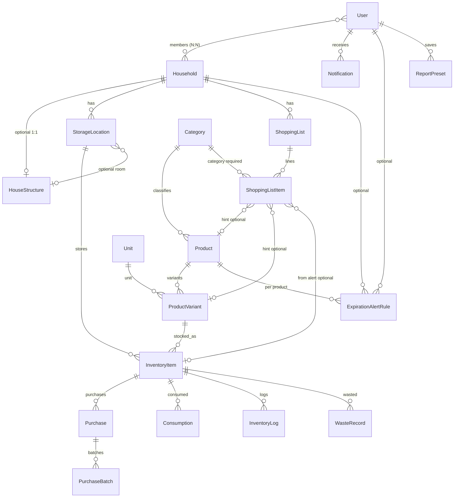

# ER 다이어그램 & 엔티티 명세 (Home Inventory Manager)

구현 대상 엔티티 목록과 관계를 정리한 문서입니다.  
README의 **「4. 도메인 & 엔티티 설계」**와 동기화해 두었습니다.  
상세 필드는 [엔티티 논리적 설계](./entity-logical-design.md), 개념만 보려면 [개념적 설계](./entity-conceptual-design.md)를 참고하세요.

---

## 1. 엔티티 목록

| 순번 | 엔티티              | 핵심 역할                                                                  | 주요 관계                            | 우선순위 |
| ---- | ------------------- | -------------------------------------------------------------------------- | ------------------------------------ | -------- |
| 1    | User                | 사용자 계정                                                                | — (Household과 N:N)                  | ★★★★★    |
| 2    | Household           | 가족·공유 그룹                                                             | User ↔ ManyToMany                    | ★★★★     |
| 3    | Category            | 대분류 (식료품, 생활용품, 의약품, 전자제품, 식기류, 가구류…) — 플랫(1단계) | —                                    | ★★★★★    |
| 4    | StorageLocation     | 보관 장소                                                                  | Household                            | ★★★★     |
| 5    | Unit                | 단위 마스터 (ml, g, 개…)                                                   | —                                    | ★★★      |
| 6    | Product             | 상품 마스터 (소모품·비소모품: 식료품, 전자제품, 가구 등)                   | Category                             | ★★★★★    |
| 7    | ProductVariant      | 용량/포장 단위별 정보                                                      | Product                              | ★★★★     |
| 8    | InventoryItem       | 실제 보유 재고                                                             | ProductVariant, StorageLocation      | ★★★★★    |
| 9    | Purchase            | 구매 기록                                                                  | InventoryItem                        | ★★★★     |
| 10   | PurchaseBatch       | 로트별 유통기한 (로트=한 번에 구매한 같은 품목·같은 유통기한 묶음)         | Purchase                             | ★★★★     |
| 11   | Consumption         | 소비/사용 기록                                                             | InventoryItem                        | ★★★★     |
| 12   | InventoryLog        | 재고 변경 이력                                                             | InventoryItem                        | ★★★      |
| 13   | WasteRecord         | 폐기 기록                                                                  | InventoryItem                        | ★★★      |
| 14   | ShoppingList        | 장보기 리스트                                                              | Household                            | ★★★★     |
| 15   | ShoppingListItem    | 리스트 항목                                                                | ShoppingList, Product/ProductVariant | ★★★★     |
| 16   | Notification        | 알림                                                                       | User                                 | ★★★★     |
| 17   | ExpirationAlertRule | 만료 알림 설정(품목별 일수)                                                | User 또는 Household, Product         | ★★★      |
| 18   | ReportPreset        | 리포트 설정 저장                                                           | User                                 | ★★       |
| 19   | HouseStructure      | 집 구조(2D/3D) 한 채 — 방·슬롯 정의(JSONB)                                 | Household 1:1                        | ★★★      |

### User ↔ Household (다대다)

- 중간 테이블(예: `HouseholdMember`, `UserHousehold`)로 가족/공유 그룹 멤버십·역할(소유자/멤버) 관리 권장.

### ShoppingListItem

- `Product`만 참조하거나 `ProductVariant`만 참조하거나, 둘 중 하나 필수 등 정책을 스키마 단계에서 결정.

---

## 2. 관계 요약 (텍스트)

```
Household (가족·공유 그룹)
  ├── HouseStructure (1:1, 선택) — 집 구조(방·슬롯 JSON)
  ├── StorageLocation (1:N) — roomId 등으로 HouseStructure와 연동 가능
  ├── ShoppingList (1:N)
  └── ExpirationAlertRule (1:N, 선택)

User
  ├── Household (N:N)
  ├── Notification (1:N)
  ├── ExpirationAlertRule (1:N, 선택, 품목별)
  └── ReportPreset (1:N)

Category
  ├── Product (1:N)  ※ 플랫 카테고리(계층 없음)
  └── ShoppingListItem (1:N, 장보기 줄 분류 기준)

Product
  ├── ProductVariant (1:N)
  ├── ExpirationAlertRule (1:N, 선택, 품목별 일수)
  └── ShoppingListItem (선택 힌트)

ProductVariant
  ├── InventoryItem (1:N)
  └── ShoppingListItem (선택 힌트)

InventoryItem
  ├── Purchase (1:N)
  ├── Consumption (1:N)
  ├── InventoryLog (1:N)
  ├── WasteRecord (1:N)
  └── ShoppingListItem (선택: 알림 출처 ref)

Purchase
  └── PurchaseBatch (1:N)

ShoppingList
  └── ShoppingListItem (1:N)
```

---

## 3. Mermaid ER 다이어그램 (개념도)

> 실제 FK·컬럼명은 구현 시 TypeORM 엔티티 기준으로 조정하세요.



- **Category**는 플랫(1단계)만 사용; `parentId`·계층 없음. **ShoppingListItem**은 카테고리를 필수로 두고, 품목/변형/재고 출처는 알림·UX에 따라 선택.
- **ExpirationAlertRule**은 품목(Product)마다 유통기한 **며칠 전** 알림 일수를 다르게 둘 수 있음.
- **HouseStructure**: 상세는 [집 구조도 백엔드 명세](./house-structure-3d-feature.md) 참고. StorageLocation에 `houseStructureId`, `roomId` 등으로 "방"과 연결 가능.

---

## 4. 유지보수

- 엔티티 추가·변경 시 **이 파일**과 README **「4. 도메인 & 엔티티 설계」** 표를 함께 수정하는 것을 권장합니다.
- 상세 ERD(draw.io 등)는 이 폴더(`docs/`)에 함께 두면 됩니다.
