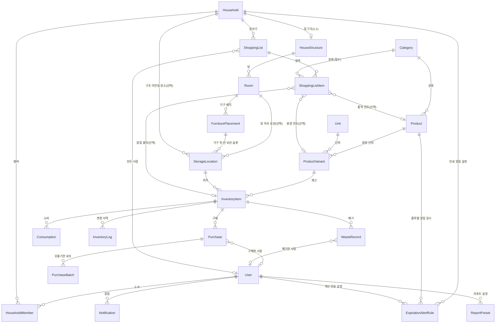

# 개념적 설계 — 엔티티와 속성

**목적**: 비즈니스 관점에서 **엔티티 이름**과 **필요한 속성**만 정리합니다.  
식별자(PK), 외래키(FK), 데이터 타입은 다루지 않습니다.

**다음 단계**: 속성의 제약·타입·식별·관계는 [엔티티 논리적 설계](./entity-logical-design.md)에서 다룹니다.

---

## 개념적 ERD (엔티티 간 관계)

> PK/FK 없이 **어떤 엔티티가 무엇과 연결되는지**만 표현합니다.

---

## User (사용자)

- 이메일
- 비밀번호(인증용 저장값)
- 표시 이름
- 이메일 인증 완료 시각(미인증 시 NULL)
- 마지막 로그인 시각

→ 가입 후 **이메일 검증**(인증 링크·토큰) 로직으로 `emailVerifiedAt` 설정.

---

## Household (가족·공유 그룹)

- 그룹 이름

---

## HouseholdMember (가족·공유 그룹 멤버십, 연관 테이블)

User와 Household의 **다대다(N:N)** 관계를 위한 **연관 테이블**(중간 테이블)입니다. 미리 두고, “그룹에 멤버 추가” 시 이 테이블에 (userId, householdId) 행을 넣는 방식으로 사용합니다.

- 사용자 (userId)
- 가족·공유 그룹 (householdId)
- 역할(소유자, 멤버 등)
- 가입 시각 (joinedAt)

---

## Category (카테고리)

- 이름
- 정렬 순서

→ **플랫(1단계)** 목록만 사용, 상위·하위 계층 없음.  
→ **장보기 리스트 항목**도 카테고리에 매달아 “식료품 코너” 등으로 묶는다(상세 품목은 나중에 재고 등록 시 확정).

---

## HouseStructure (집 구조)

- 소속 가족·공유 그룹 (Household 1:1)
- 구조 이름 (예: "우리 집")
- 구조 데이터 (방·슬롯 정의, JSONB)
- (선택) 스키마 버전

→ 상세: [집 구조도 백엔드 명세](./house-structure-3d-feature.md)

---

## Room (방)

집 구조(`HouseStructure`) 안의 **방 단위**를 앱에서 일관되게 가리키기 위한 엔티티입니다. 2D/3D 편집기의 `structurePayload` 안 room id와 **동일한 키**를 두어, “어느 방인지”를 문자열 맥락 없이 FK로 연결합니다.

- 소속 집 구조 (HouseStructure)
- 구조 데이터와 맞추는 **방 키**(JSON 내 room id와 동일)
- 표시 이름(선택, 편집기 라벨과 다를 때)
- 정렬 순서

---

## FurniturePlacement (가구 배치)

**특정 방 안에서** “이 책상·이 장롱·이 협탁”처럼 **가구 인스턴스**를 구분하는 엔티티입니다. 가구 **종류**는 `Product`(가구류)로 둘 수 있고, **배치**는 방마다 여러 개가 생깁니다. 재고(물품)는 이 배치에 매달린 **보관 슬롯**(`StorageLocation`)을 통해 연결됩니다.

- 소속 방 (Room)
- 배치 이름 또는 별칭(예: "책상", "침대 옆 협탁")
- (선택) 가구 상품·변형 — Product / ProductVariant (같은 종류 가구가 여러 개면 **별칭·정렬**으로 구분)
- 정렬 순서
- (선택) 배치 메타 — 3D 좌표·회전 등(JSON, 집 구조 편집기와 동기 시)

---

## StorageLocation (보관 장소 / 보관 슬롯)

**물품이 놓이는 최종 칸**입니다. 방만 있거나, 가구 배치 아래 세분화할 수 있습니다.

- 소속 가족·공유 그룹
- 장소 이름(예: "책상 서랍 왼쪽", "냉장고 문쪽")
- 정렬 순서
- (선택) **방** — Room (부엌·안방 등 방 단위로 묶을 때)
- (선택) **가구 배치** — FurniturePlacement (그 가구 위·안의 칸일 때; 있으면 방은 배치를 통해 암시 가능)
- 레거시: 집 구조 JSON만 쓰던 기간에는 HouseStructure + room 문자열로 연결하던 방식을 **Room·FurniturePlacement로 이전**하는 것을 권장

---

## Unit (단위)

- 단위 기호(예: ml, g, 개)
- 표시 이름
- 정렬 순서

---

## Product (상품)

- 카테고리
- 상품 이름
- 상품 이미지(URL 또는 스토리지 키, 선택)
- 설명(선택)
- **isConsumable**(소비형 vs 사용형): `true`면 음식·생필품 등 **소비·소모**되는 품목, `false`면 후라이팬·식기세척기 등 **장기 사용** 품목

→ 바코드는 수집하지 않음.

---

## ProductVariant (상품 용량·포장 단위)

- 상품
- 단위
- 단위당 수량(예: 1팩당 6개)
- 표시용 이름
- 참고 단가(price, 선택)
- SKU(선택)
- 대표 용량 여부

→ 바코드는 사용하지 않음.

---

## InventoryItem (재고 품목)

- 상품 변형
- 보관 장소
- 현재 수량
- 최소 재고 기준(잔량 부족 알림용)

---

## Purchase (구매 기록)

- 재고 품목
- 구매 수량
- 구매 일시
- 단가
- 총액
- 메모
- 구매 수행 사용자(선택)
- 구매처 이름(선택)

---

## PurchaseBatch (유통기한 로트)

- 구매 기록
- 로트 수량
- 유통기한

---

## Consumption (소비 기록)

- 재고 품목
- 소비 수량
- 사용 일시
- 메모

---

## InventoryLog (재고 변경 이력)

- 재고 품목
- 변경 유형(입고, 출고, 조정, 폐기 등)
- 수량 변화
- 변경 후 수량
- 관련 기록 참조(어떤 구매·소비·폐기와 연결됐는지)
- 발생 시각
- 메모
- 변경한 사용자(선택)
  → 재고는 **자동으로 맞춰지지 않으며**, 사용자가 수행한 작업에 맞춰 이력을 남김.

---

## WasteRecord (폐기 기록)

- 재고 품목
- 폐기 수량
- 폐기 수행 사용자(선택)
- 사유
- 폐기 일시
- 메모

---

## ShoppingList (장보기 리스트)

- 가족·공유 그룹
- 리스트 이름
- 상태
- 마감(예정)일
- 만든 사용자(선택)

---

## ShoppingListItem (장보기 항목)

- 장보기 리스트
- **카테고리(필수)** — 알림에서 자동 추가할 때도 이 분류로 들어감
- (선택) 상품·상품 변형 — 부족/만료 알림에서 넘어오면 **제안값**(마트에서 다른 용량을 살 수 있음)
- (선택) 알림이 가리킨 재고 품목 — 등록 화면 프리필·구분용
- 수량(대략)
- 정렬 순서
- 체크(구매 완료) 여부
- 메모(같은 카테고리 안에서 “참치/스팸” 등 짧게 구분)

**재고에 올릴 때**: 사용자가 **브랜드·용량·유통기한·금액·구매일** 등을 선택·입력해 실제 `Purchase`·`InventoryItem` 등으로 반영한다(논리 설계 §18).

---

## Notification (알림)

- 수신 사용자
- 알림 유형
- 제목
- 본문
- 읽은 시각
- 관련 대상 참조(어떤 품목·로트 등과 연결되는지)
  → 기본은 **모바일 앱 알림**(푸시 등); 별도 채널 구분 필드는 두지 않음.

---

## ExpirationAlertRule (만료 알림 설정)

- 소유 주체(사용자 또는 가족·공유 그룹)
- **품목**(Product) — 품목마다 **며칠 전에 알릴지** 다르게 설정
- 유통기한 며칠 전 알림
- 활성 여부
- **중복 불가**: 동일 소유 주체(가족이면 household, 개인이면 user)와 동일 품목 조합에 규칙은 **하나만** ([엔티티 논리적 설계](./entity-logical-design.md) §20의 CHECK·유니크 제약 참고)

---

## ReportPreset (리포트 설정)

- 사용자
- 설정 이름
- 설정 내용(필터, 기간 등)
- 정렬 순서

---

## 개념적 설계 메모

- **로트**: 한 번에 구매한 같은 품목 묶음, 같은 유통기한 단위. PurchaseBatch가 이를 표현합니다.
- **가족·공유 그룹(Household)** 과 **가구(침대·책상)** 는 다릅니다. **종류·마스터**는 `Product`·`Category`(가구류), **우리 집 안의 실제 배치**는 `FurniturePlacement`(방 소속)로 관리합니다.
- **위치 계층(권장)**: `Room`(방) → `FurniturePlacement`(가구 배치) → `StorageLocation`(보관 슬롯) → `InventoryItem`(물품·재고). 방만 쓰거나 가구 없이 슬롯만 둔 단순 모델도 허용합니다.
- **알림 → 장보기 → 재고**: 만료 임박·재고 부족 푸시를 누르면 **카테고리(및 가능하면 재고/Variant 힌트)** 가 장보기에 쌓이고, 집에 들어와 **재고 등록**할 때만 동원/리챔·g·유통기한·금액·구매일 등을 확정한다.

### 기타 추가 예정(참고)

[policy/considerations.md](./policy/considerations.md)에 정리된 기능·엔티티 후보: **Recipe**, **Brand**, **Supplier**, **Photo**, **Integration**(알림 채널), **AuditLog**(활동 로그) 등. 필요 시 개념/논리 설계에 순차 반영. (가계부·구독·예산은 별도 프로젝트 권장.)
