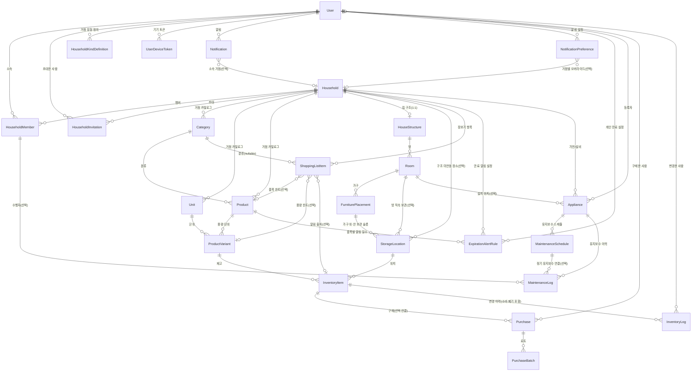

# 개념적 설계 v2 — 엔티티와 속성

**버전**: v2.7 — Appliance·MaintenanceSchedule·MaintenanceLog 신규 엔티티 추가 (2026-04-03)

**v2.7 변경**:
- Appliance, MaintenanceSchedule, MaintenanceLog 신규 엔티티 추가 (가전/설비 관리)
- 가전은 재고 Item과 별도 테이블 — 장기 자산(보증·유지보수)과 소모품(수량 추적)은 관심사가 다름
- 재고 시스템 출시 전 선행 필요 (사용자가 가전을 Item으로 잘못 등록하는 것 방지)

**v2.6 변경**:
- UserDeviceToken 신규 엔티티 추가 (FCM 푸시 알림용 기기 토큰 관리)

**v2.5 변경**:
- 모든 엔티티 PK를 UUID로 확정
- Purchase에서 `quantity`(파생값), `totalPrice`(파생값) 제거

**v2.4 변경**:
- NotificationPreference에 마스터 토글 3컬럼 추가 (`notifyExpiration`, `notifyShopping`, `notifyLowStock`)
- 장보기 완료 트랜잭션 API 스펙 정의

**v2.3 변경**:
- HouseholdKindDefinition 신규 엔티티 추가 (사용자별 거점 유형 라벨·순서 관리)

**v2.2 변경**:
- HouseholdInvitation 신규 엔티티 추가 (초대 링크·이메일 초대 지원)
- HouseholdMember 역할을 3단계로 확장: admin(관리자) / editor(편집자) / viewer(조회자)

**v2.1 변경**:
- Category, Unit, Product에 `소속 거점` 추가 (카탈로그 Household-scoped)
- NotificationPreference 신규 엔티티 추가
- "다른 거점 카탈로그 가져오기" 기능 예정

**v2 변경**:
- Consumption, WasteRecord 제거 → InventoryLog로 통합
- ShoppingList 제거 → ShoppingListItem이 Household에 직접 연결
- Household에 `거점 유형(kind)` 추가
- Purchase에 `구매처 이름`, `inventoryItemId 선택`, `품목명 스냅샷 3필드` 추가
- Notification에 `소속 거점` 추가

**v1 원본**: [v1/entity-conceptual-design.md](../v1/entity-conceptual-design.md)
**다음 단계**: 속성의 제약·타입·식별·관계는 [엔티티 논리적 설계 v2](./entity-logical-design.md)에서 다룹니다.

---

## 개념적 ERD (엔티티 간 관계)

---

## User (사용자)

- 이메일
- 비밀번호(인증용 저장값)
- 표시 이름
- 이메일 인증 완료 시각(미인증 시 NULL)
- 마지막 로그인 시각

---

## Household (거점)

- 그룹 이름
- **거점 유형(kind)** — home, office, vehicle, other + 사용자 정의 **(v2 추가)**

---

## HouseholdMember (멤버십, 연관 테이블)

- 사용자 (userId)
- 거점 (householdId)
- **역할** — admin(관리자: 전체 + 멤버 관리) / editor(편집자: 조회·추가·수정) / viewer(조회자: 조회만) **(v2.2 확장)**
- 가입 시각 (joinedAt)

---

## HouseholdInvitation (초대) — v2.2 신규

- 대상 거점 (householdId)
- 초대한 사용자 (invitedByUserId)
- 수락 시 역할 (admin / editor / viewer)
- 고유 토큰 (URL 포함)
- 상태 (pending / accepted / expired / revoked)
- (선택) 초대 대상 이메일 — 지정 시 해당 이메일만 수락 가능, 미지정 시 링크 공유형
- (선택) 수락한 사용자 · 수락 시각
- 만료 시각

> 초대 수락 시 HouseholdMember 행이 생성된다. 미가입 사용자는 가입 후 토큰으로 수락.

---

## HouseholdKindDefinition (거점 유형 정의) — v2.3 신규

- 소유 사용자 (userId)
- 유형 식별자 (kindId) — 'home', 'office', 'vehicle', 'other' + 사용자 정의
- 표시 라벨 — '집', '사무실', '차량', '기타' 등 (사용자가 수정 가능)
- 정렬 순서

> 사용자별로 거점 유형 라벨과 순서를 관리한다. Household.kind varchar에는 kindId 값이 저장되며, FK 제약 없이 느슨하게 참조한다. 가입 시 기본 4종이 시드된다.

---

## Category (카테고리)

- **소속 거점** (Household) **(v2.1 추가)**
- 이름
- 정렬 순서

> **플랫(1단계)** 목록만 사용, 상위·하위 계층 없음. 거점별로 분리되며, "다른 거점에서 가져오기"로 복사 가능.

---

## HouseStructure (집 구조)

- 소속 거점 (Household 1:1)
- 구조 이름 (예: "우리 집")
- 구조 데이터 (방·슬롯 정의, JSONB)
- **구조도 레이아웃** (2D 좌표, JSONB) **(v2 추가)**
- (선택) 스키마 버전

---

## Room (방)

- 소속 집 구조 (HouseStructure)
- 방 키(JSON 내 room id와 동일)
- 표시 이름(선택)
- 정렬 순서

---

## FurniturePlacement (가구)

- 소속 방 (Room)
- 배치 이름 또는 별칭
- (선택) 가구 상품·변형 — Product / ProductVariant
- **대표 보관 슬롯** (UI 앵커링용) **(v2 추가)**
- 정렬 순서
- (선택) 배치 메타 — 3D 좌표·회전 등

---

## StorageLocation (보관 장소 / 보관 슬롯)

- 소속 거점
- 장소 이름
- 정렬 순서
- (선택) 방 — Room
- (선택) 가구 — FurniturePlacement

---

## Unit (단위)

- **소속 거점** (Household) **(v2.1 추가)**
- 단위 기호(예: ml, g, 개)
- 표시 이름
- 정렬 순서

---

## Product (상품)

- **소속 거점** (Household) **(v2.1 추가)**
- 카테고리
- 상품 이름
- 상품 이미지(URL, 선택)
- 설명(선택)
- isConsumable(소비형 vs 사용형)

---

## ProductVariant (상품 용량·포장 단위)

- 상품
- 단위
- 단위당 수량
- 표시용 이름
- 참고 단가(price, 선택)
- SKU(선택)
- 대표 용량 여부

---

## InventoryItem (재고 품목)

- 상품 변형
- 보관 장소
- 현재 수량
- 최소 재고 기준(잔량 부족 알림용)

---

## Purchase (구매 기록)

- **소속 거점** **(v2.2 추가)** — 거점별 구매 필터링 및 미연결 구매의 거점 귀속
- 재고 품목 **(v2 변경: 선택 — 구매만 먼저, 재고 연결은 나중에)**
- 단가
- 구매 일시
- **구매처 이름(선택)** **(v2 추가)** — 1차 수기 입력, Supplier 테이블은 통계 기능 시 추가 예정
- **품목명 스냅샷** **(v2 추가)** — 품목 삭제 시에도 구매 내역 표시용 (itemName, variantCaption, unitSymbol)
- 메모
- 구매 수행 사용자(선택)

---

## PurchaseBatch (로트)

- 구매 기록
- 로트 수량
- 유통기한

---

## InventoryLog (재고 변경 이력) — v2 통합

> **v2 변경**: v1의 Consumption(소비 기록) + WasteRecord(폐기 기록)을 통합.

- 재고 품목
- 변경 유형(입고, 소비, 조정, 폐기)
- 수량 변화
- 변경 후 수량
- **폐기 사유**(type=waste 시, 선택) **(v2 추가)**
- **품목명 스냅샷**(조회 편의용, 선택) **(v2 추가)**
- 관련 기록 참조(어떤 구매와 연결됐는지)
- 발생 시각
- 메모
- 변경한 사용자(선택)

### v1에서 제거된 엔티티 매핑

| v1 엔티티 | v2 대체 | 매핑 |
|-----------|---------|------|
| Consumption (소비 기록) | InventoryLog | type='out', 소비 수량 → quantityDelta(음수) |
| WasteRecord (폐기 기록) | InventoryLog | type='waste', reason 필드에 사유 |

---

## ShoppingListItem (장보기 항목) — v2 변경

> **v2 변경**: ShoppingList(부모) 제거. Household에 직접 연결. checked 제거 (구매 완료 시 행 삭제).

- **소속 거점** (v1: 장보기 리스트 → v2: Household 직접)
- 카테고리 **(v2 변경: nullable)** — 현재 프론트는 항상 채우지만, 자유 텍스트 장보기 항목 확장 대비
- (선택) 상품·상품 변형 — 부족/만료 알림에서 넘어오면 제안값
- (선택) 알림이 가리킨 재고 품목
- **(선택) 넣을 칸 힌트** — 보관 장소 **(v2 추가)**
- 수량(대략)
- 정렬 순서
- 메모

### v1에서 제거된 엔티티

| v1 엔티티 | 사유 |
|-----------|------|
| ShoppingList (장보기 리스트) | 프론트에 리스트 이름·마감일·상태 개념이 없음. 장보기 항목이 Household에 직접 연결 |

---

## Notification (알림)

- 수신 사용자
- **소속 거점(선택)** **(v2 추가)**
- 알림 유형
- 제목
- 본문
- 읽은 시각
- 관련 대상 참조

---

## NotificationPreference (알림 설정) — v2.1 신규

- 사용자 (userId)
- 소속 거점(선택) — null이면 사용자 기본 설정, 값이 있으면 거점별 오버라이드
- **유통기한 알림 마스터 토글** (notifyExpiration, default true) **(v2.4 추가)**
- **장보기 알림 마스터 토글** (notifyShopping, default true) **(v2.4 추가)**
- **재고 부족 알림 마스터 토글** (notifyLowStock, default false) **(v2.4 추가)**
- 유통기한 알림 일수 (expirationDaysBefore)
- 알림 범위 (household / personal)
- 만료 로트 알림 여부
- 만료 당일 리마인더
- 장보기 리스트 변경 알림
- 장보기 리마인더 (요일 설정)
- 재고 부족 알림 정책 (minStockLevel 기준)

> 마스터 토글이 false이면 해당 카테고리의 세부 설정은 모두 무시된다. 백엔드 알림 스케줄러가 마스터 토글을 먼저 확인.
> 확장: 알림 채널(이메일/푸시), 조용한 시간, 알림 유형별 세분화 가능.

---

## ExpirationAlertRule (만료 알림 설정)

- 소유 주체(사용자 또는 거점)
- 품목(Product)
- 유통기한 며칠 전 알림
- 활성 여부

---

## UserDeviceToken (기기 토큰) — v2.6 신규

- 소유 사용자 (userId)
- FCM 등록 토큰 (고유)
- 플랫폼 (web / android / ios)
- (선택) 기기 식별 정보 (User-Agent 등)
- 활성 여부 — FCM 무효 응답 시 비활성화

> 한 사용자가 여러 기기에서 로그인할 수 있으므로 User와 1:N. 알림 발송 시 사용자의 활성 토큰 전체에 푸시를 전송한다. 로그아웃 시 해당 토큰 삭제.

---

## Appliance (가전/설비) — v2.7 신규

- 소속 거점 (Household)
- 설치 위치 (Room, 선택)
- 등록자 (User)
- 이름 — 예: "드럼세탁기", "에어컨(거실)"
- 브랜드 (선택)
- 모델명 (선택)
- 시리얼넘버 (선택)
- 구매일 (선택)
- 구매 가격 (선택)
- 보증 만료일 (선택)
- 매뉴얼 URL (선택)
- 상태 — `active`(사용 중) / `retired`(폐기/교체)
- 메모 (선택)

> 재고 관리의 InventoryItem과는 별도 테이블. InventoryItem은 소모성 물품(수량 추적), Appliance는 장기 자산(보증·유지보수 추적). 재고 시스템 출시 전에 이 기능이 먼저 나와야 사용자가 가전을 Item으로 잘못 등록하는 것을 방지할 수 있다.

---

## MaintenanceSchedule (유지보수 스케줄) — v2.7 신규

- 대상 가전 (Appliance)
- 작업명 — 예: "에어컨 필터 교체", "정수기 필터 교체"
- 설명 (선택)
- 반복 규칙 (recurrenceRule, JSONB)
- 다음 예정일 (nextOccurrenceAt)
- 활성 여부

> 스케줄러가 매일 `nextOccurrenceAt`을 확인하여 알림 생성. 완료 시 MaintenanceLog에 기록하고 다음 예정일 갱신. recurrenceRule은 upcoming 가계부의 RecurringTransaction과 동일한 JSONB 구조를 사용할 예정.

---

## MaintenanceLog (유지보수·A/S 이력) — v2.7 신규

- 대상 가전 (Appliance)
- 연결 스케줄 (MaintenanceSchedule, 선택) — 정기 유지보수에서 발생한 경우
- 유형 — `scheduled`(정기) / `repair`(수리) / `inspection`(점검) / `other`(기타)
- 작업 내용
- 수행자 (HouseholdMember, 선택) — 가구 구성원이 직접 한 경우
- 수행 업체 (선택) — 외부 A/S인 경우
- 비용 (선택)
- 수행일
- 메모 (선택)

> 정기 유지보수와 비정기 수리/A/S를 하나의 테이블에서 관리. 비용이 있으면 향후 가계부 연동 가능.

---

---

## 사용하지 않음 (P3 — 1차 개발 범위 외)

> 아래 엔티티는 현재 프론트엔드 UI가 없거나, 기존 기능으로 대체 가능하여 1차 개발에서 제외합니다.

### 리포트 설정

- 사용자
- 설정 이름
- 설정 내용(필터, 기간 등)
- 정렬 순서

### 태그

- 태그 이름
- 상품과 연결 (N:N)

> 카테고리로 대체 가능.

---

## 개념적 설계 메모

- **v2 통합 결정**: 소비(Consumption)·폐기(WasteRecord)를 InventoryLog 하나로 합쳤다. 이력 조회가 단일 테이블로 가능하고, 프론트 `InventoryLedgerRow` 타입과 1:1 대응.
- **v2 구조 단순화**: 장보기 리스트(ShoppingList)의 부모-자식 2단 구조를 제거하고, 항목(ShoppingListItem)이 Household에 직접 연결. 프론트에 리스트 이름·마감일 개념이 없었기 때문.
- **v2.5 UUID + 파생값 정리**: 전체 PK를 UUID로 확정. Purchase에서 `quantity`(→ `SUM(batch.quantity)`)와 `totalPrice`(→ `unitPrice × 총수량`)를 제거하여 단일 출처 유지.
- **v2.3 거점 유형 테이블화**: HouseholdKindDefinition 테이블 추가. 프론트 설정 화면의 거점 유형 CRUD(추가/수정/삭제/정렬)를 백엔드에서 지원. 사용자별로 관리하며, Household.kind와 느슨한 참조.
- **v2.2 초대·권한 확장**: HouseholdInvitation 테이블 추가로 링크/이메일 초대 플로우 지원. HouseholdMember.role을 admin/editor/viewer 3단계로 세분화하여 거점별 접근 제어 실현.
- **v2.1 카탈로그 Household-scoped**: Category·Unit·Product가 거점에 귀속. 같은 거점 멤버끼리 공유하며, "다른 거점 카탈로그 가져오기"로 거점 간 복사 가능.
- **v2.1 알림 설정 테이블화**: NotificationPreference를 별도 테이블로 분리. 사용자 기본값 + 거점별 오버라이드 구조.
- **v2.6 기기 토큰 테이블**: UserDeviceToken 추가로 FCM 푸시 알림 지원. 한 사용자가 여러 기기에서 토큰을 등록하며, 알림 발송 시 활성 토큰 전체에 전송. NotificationPreference의 "알림 채널 확장" 방향과 연계.
- **v2.7 가전/설비 분리 결정**: Appliance를 InventoryItem과 별도 테이블로 분리. Item은 소모품(수량·유통기한 추적), Appliance는 장기 자산(보증·유지보수·A/S 이력 추적). 재고 시스템 출시 전에 가전 기능이 선행되어야 Item으로의 잘못된 등록을 방지.
- **v2.7 recurrenceRule 재활용**: MaintenanceSchedule의 반복 규칙은 upcoming 가계부 도메인의 RecurringTransaction과 동일한 JSONB 구조를 사용하여 도메인 간 일관성 확보.
- **위치 계층(권장)**: `Room`(방) → `FurniturePlacement`(가구) → `StorageLocation`(보관 슬롯) → `InventoryItem`(재고).
- **알림 → 장보기 → 재고**: 만료 임박·재고 부족 → 장보기에 항목 추가 → 구매 완료 시 Purchase·InventoryItem 반영 + 장보기 행 삭제.

---

*본 문서는 [frontend-backend-alignment.md](../../alignment/frontend-backend-alignment.md) §1~§4 결정에 따라 v1에서 갱신되었습니다.*
