# 개념적 설계 — 가계부·투자 포트폴리오·집안일·식단

**버전**: v1.1 — 집안일·식단 도메인 추가 (2026-04-03)

**범위**: 가계부(개인/그룹) + 정기 거래 + 투자 포트폴리오(개인/그룹) + 집안일 관리 + 식단/레시피 관리

> **가전/설비 관리**는 재고 시스템 출시 전 선행 필요하여 `docs/design/v2/` (v2.7)로 이동했습니다.

**관련 문서**:
- [논리적 설계](./entity-logical-design.md)
- [참고 내용 (실시간 협업·자산 API 등)](./reference.md)
- [집비치기 개념적 설계](../design/v2/entity-conceptual-design.md)

> **계정 연동**: 집비치기의 `User` 엔티티를 그대로 공유한다. 가계부/포트폴리오에서 별도 회원가입 없이 기존 계정으로 접근.

---

## 엔티티 목록

| 순번 | 엔티티 | 핵심 역할 | 도메인 | 우선순위 |
| ---- | ---- | ---- | ---- | ---- |
| 1 | Ledger | 가계부 (개인/그룹) | 가계부 | P0 |
| 2 | LedgerMember | 가계부 멤버십 | 가계부 | P0 |
| 3 | LedgerInvitation | 가계부 그룹 초대 | 가계부 | P0 |
| 4 | TransactionCategory | 거래 분류 카테고리 | 가계부 | P0 |
| 5 | Transaction | 수입/지출 거래 내역 | 가계부 | P0 |
| 6 | RecurringTransaction | 정기 거래 (구독·급여·배당 등) | 가계부 | P1 |
| 7 | Portfolio | 투자 포트폴리오 (개인/그룹) | 투자 | P1 |
| 8 | PortfolioMember | 포트폴리오 멤버십 | 투자 | P1 |
| 9 | PortfolioInvitation | 포트폴리오 그룹 초대 | 투자 | P1 |
| 10 | Asset | 자산 마스터 (주식·ETF·코인·리츠 등) | 투자 | P1 |
| 11 | AssetPriceCache | 자산 시세 캐시 | 투자 | P1 |
| 12 | PortfolioHolding | 보유 자산 | 투자 | P1 |
| 13 | PortfolioTransaction | 매매·배당 기록 | 투자 | P1 |
| 14 | AuditLog | CRUD 감사 로그 (가계부·포트폴리오 공용) | 공통 | P0 |
| 15 | Chore | 가사 항목 정의 (반복 규칙 포함) | 집안일 | P1 |
| 16 | ChoreAssignment | 가사 담당자 할당 | 집안일 | P1 |
| 17 | ChoreLog | 가사 완료 기록 | 집안일 | P1 |
| 18 | Recipe | 레시피 | 식단 | P1 |
| 19 | RecipeIngredient | 레시피 필요 재료 (Product 연결) | 식단 | P1 |
| 20 | MealPlan | 식단 계획 | 식단 | P1 |
| 21 | MealPlanEntry | 식단 계획 내 개별 항목 (날짜+끼니+레시피) | 식단 | P1 |

> **기존 공유 엔티티**: User, Household, HouseholdMember, Room, Product (집비치기)
>
> **가전/설비 (Appliance, MaintenanceSchedule, MaintenanceLog)** — `docs/design/v2/` v2.7로 이동. 재고 시스템 출시 전 선행 필요.

---

## 개념적 ERD

```mermaid
erDiagram
    User ||--o{ LedgerMember : "소속"
    Ledger ||--o{ LedgerMember : "멤버"
    Ledger ||--o{ LedgerInvitation : "초대"
    User ||--o{ LedgerInvitation : "초대한 사람"

    Ledger ||--o{ TransactionCategory : "분류"
    Ledger ||--o{ Transaction : "거래"
    Ledger ||--o{ RecurringTransaction : "정기 거래"
    TransactionCategory ||--o{ Transaction : "분류"
    TransactionCategory ||--o{ RecurringTransaction : "분류"
    User ||--o{ Transaction : "작성자"
    User ||--o{ RecurringTransaction : "작성자"

    User ||--o{ PortfolioMember : "소속"
    Portfolio ||--o{ PortfolioMember : "멤버"
    Portfolio ||--o{ PortfolioInvitation : "초대"
    User ||--o{ PortfolioInvitation : "초대한 사람"

    Portfolio ||--o{ PortfolioHolding : "보유"
    Asset ||--o{ PortfolioHolding : "자산"
    Asset ||--o{ AssetPriceCache : "시세"
    PortfolioHolding ||--o{ PortfolioTransaction : "매매"
    User ||--o{ PortfolioTransaction : "작성자"

    Ledger ||--o{ AuditLog : "감사 로그"
    Portfolio ||--o{ AuditLog : "감사 로그"
    User ||--o{ AuditLog : "수행자"

    Household ||--o{ Chore : "소속"
    Chore ||--o{ ChoreAssignment : "할당"
    HouseholdMember ||--o{ ChoreAssignment : "담당자"
    Chore ||--o{ ChoreLog : "완료 기록"
    HouseholdMember ||--o{ ChoreLog : "수행자"

    Household ||--o{ Recipe : "소속"
    User ||--o{ Recipe : "작성자"
    Recipe ||--o{ RecipeIngredient : "재료"
    Product ||--o{ RecipeIngredient : "제품 연결"
    Household ||--o{ MealPlan : "소속"
    MealPlan ||--o{ MealPlanEntry : "항목"
    Recipe ||--o{ MealPlanEntry : "레시피"
```



---

## Ledger (가계부)

- 이름
- 유형 — `personal`(개인) / `group`(그룹)
- 소유자 (userId) — 생성자이자 최초 관리자
- 통화 (currency) — KRW, USD 등 기본 통화

> 개인 가계부는 소유자만 접근. 그룹 가계부는 LedgerMember를 통해 여러 사용자 접근.

---

## LedgerMember (가계부 멤버십)

- 가계부 (ledgerId)
- 사용자 (userId)
- 역할 — `admin`(관리자, 1명만) / `member`(일반 멤버)
- 가입 시각

> 그룹 가계부 전용. 관리자는 한 명만 가능하며 양도 가능. 모든 멤버는 읽기·쓰기·수정·삭제 권한 보유. 관리자는 추가로 CRUD 로그 조회 및 롤백 권한 보유.

---

## LedgerInvitation (가계부 초대)

- 대상 가계부 (ledgerId)
- 초대한 사용자 (invitedByUserId)
- 고유 토큰
- 상태 — `pending` / `accepted` / `expired` / `revoked`
- (선택) 초대 대상 이메일
- (선택) 수락한 사용자 · 수락 시각
- 만료 시각

> 집비치기 HouseholdInvitation과 동일한 패턴. 수락 시 LedgerMember 행 생성.

---

## TransactionCategory (거래 분류)

- 소속 가계부 (ledgerId)
- 이름
- 유형 — `income`(수입) / `expense`(지출)
- 아이콘 (선택)
- 색상 (선택)
- 정렬 순서

> 가계부별 1단계 플랫 카테고리. 가입 시 기본 카테고리 시드 (식비, 교통, 급여 등).

---

## Transaction (거래 내역)

- 소속 가계부 (ledgerId)
- 분류 (categoryId)
- 유형 — `income`(수입) / `expense`(지출)
- 금액 (amount) — 항상 양수, 유형으로 입출금 구분
- 설명 (description)
- 메모 (선택)
- 거래 일시 (transactedAt)
- 작성자 (userId)
- 연결 정기 거래 (recurringTransactionId, 선택) — 정기 거래에서 자동 생성된 경우

> 그룹 가계부에서 거래 생성·수정·삭제 시 다른 멤버에게 알림 전송. 모든 CRUD는 AuditLog에 기록.

---

## RecurringTransaction (정기 거래)

- 소속 가계부 (ledgerId)
- 분류 (categoryId)
- 유형 — `income`(수입) / `expense`(지출)
- 금액
- 설명 (예: "넷플릭스 구독", "월급", "삼성전자 배당금")
- 메모 (선택)
- 반복 규칙 (recurrenceRule, JSONB) — 아래 구조
- 다음 발생일 (nextOccurrenceAt)
- 시작일 (startDate)
- 종료일 (endDate, 선택) — 미지정 시 무기한
- 활성 여부 (isActive)
- 작성자 (userId)

**recurrenceRule JSONB 구조**:
```json
{
  "frequency": "monthly",
  "interval": 1,
  "dayOfMonth": 17,
  "dayOfWeek": null,
  "monthOfYear": null
}
```

| frequency | interval 예시 | 설명 |
|-----------|-------------|------|
| `daily` | 1 | 매일 |
| `weekly` | 1 | 매주 (dayOfWeek: 0=일 ~ 6=토) |
| `monthly` | 1 | 매월 (dayOfMonth: 1~31) |
| `monthly` | 3 | 3개월마다 |
| `yearly` | 1 | 매년 (monthOfYear + dayOfMonth) |

> 스케줄러(@nestjs/schedule)가 매일 `nextOccurrenceAt`을 확인하여 Transaction을 자동 생성하고, 다음 발생일을 갱신한다.

---

## Portfolio (투자 포트폴리오)

- 이름
- 유형 — `personal`(개인) / `group`(그룹)
- 소유자 (userId) — 생성자이자 최초 관리자
- 기준 통화 (baseCurrency) — KRW, USD 등

> 개인 포트폴리오는 소유자만 접근. 그룹 포트폴리오는 PortfolioMember를 통해 여러 사용자 접근. 실시간 공유는 불필요하나 CRUD 로그 + 롤백은 필요.

---

## PortfolioMember (포트폴리오 멤버십)

- 포트폴리오 (portfolioId)
- 사용자 (userId)
- 역할 — `admin`(관리자, 1명만) / `member`(일반 멤버)
- 가입 시각

> 그룹 포트폴리오 전용. 관리자 양도 가능. 관리자는 CRUD 로그 조회 및 롤백 권한.

---

## PortfolioInvitation (포트폴리오 초대)

- 대상 포트폴리오 (portfolioId)
- 초대한 사용자 (invitedByUserId)
- 고유 토큰
- 상태 — `pending` / `accepted` / `expired` / `revoked`
- (선택) 초대 대상 이메일
- (선택) 수락한 사용자 · 수락 시각
- 만료 시각

> LedgerInvitation과 동일 패턴.

---

## Asset (자산 마스터)

- 심볼 (symbol) — 예: AAPL, BTC, 005930.KS
- 이름 — 예: "Apple Inc.", "Bitcoin", "삼성전자"
- 자산 유형 — `stock` / `etf` / `crypto` / `reit` / `bond` / `fund` / `other`
- 거래소 (exchange, 선택) — NYSE, KOSPI, Binance 등
- 통화 (currency)
- 국가 (country, 선택)
- 마지막 시세 갱신 시각

> 전역 테이블. 사용자가 자산을 검색하면 외부 API에서 조회 후 캐싱. 중복 방지를 위해 `(symbol, exchange)` 유니크.

---

## AssetPriceCache (자산 시세 캐시)

- 자산 (assetId)
- 현재가 (price)
- 통화 (currency)
- 변동률 (changePercent, 선택)
- 조회 시각 (fetchedAt)

> 외부 API 호출 최소화를 위한 시세 캐시. TTL 기반 갱신 (주식: 15분~1시간, 코인: 5분).

---

## PortfolioHolding (보유 자산)

- 포트폴리오 (portfolioId)
- 자산 (assetId)
- 보유 수량 (quantity)
- 평균 매입 단가 (averageCostBasis)
- 메모 (선택)

> 포트폴리오당 동일 자산은 1행. 매매 시 수량·평균 단가 갱신.

---

## PortfolioTransaction (매매·배당 기록)

- 보유 자산 (holdingId)
- 유형 — `buy`(매수) / `sell`(매도) / `dividend`(배당)
- 수량
- 단가 (pricePerUnit)
- 총액 (totalAmount)
- 수수료 (fee, 선택)
- 거래 일시 (transactedAt)
- 작성자 (userId)
- 메모 (선택)

---

## AuditLog (감사 로그) — 가계부·포트폴리오 공용

- 도메인 — `ledger` / `portfolio`
- 대상 ID (scopeId) — ledgerId 또는 portfolioId
- 수행자 (userId)
- 대상 엔티티 유형 (entityType) — 예: `Transaction`, `PortfolioHolding`
- 대상 엔티티 ID (entityId)
- 작업 유형 (action) — `create` / `update` / `delete`
- 변경 전 스냅샷 (beforeSnapshot, JSONB, 선택) — update·delete 시
- 변경 후 스냅샷 (afterSnapshot, JSONB, 선택) — create·update 시
- 롤백 여부 (isRolledBack) — 관리자가 롤백한 경우 true
- 롤백한 사용자 (rolledBackByUserId, 선택)
- 롤백 시각 (rolledBackAt, 선택)

> 그룹 관리자가 AuditLog를 조회하고, 특정 작업을 롤백할 수 있다. 롤백 시 beforeSnapshot을 기반으로 엔티티를 복원하고, 롤백 자체도 새 AuditLog로 기록한다.

---

## Chore (집안일)

- 소속 가구 (householdId)
- 이름 — 예: "거실 청소", "분리수거", "화장실 청소"
- 설명 (선택)
- 반복 규칙 (recurrenceRule, JSONB) — 동일 구조 재활용
- 다음 예정일 (nextOccurrenceAt)
- 활성 여부 (isActive)
- 아이콘 (선택)
- 색상 (선택)

> Household 스코프. 반복 규칙은 RecurringTransaction·MaintenanceSchedule과 동일한 `recurrenceRule` JSONB 패턴.

---

## ChoreAssignment (가사 담당자 할당)

- 가사 (choreId)
- 담당자 (householdMemberId)

> 하나의 가사에 여러 담당자 할당 가능. 가사 예정일에 할당된 담당자에게 알림 전송.

---

## ChoreLog (가사 완료 기록)

- 가사 (choreId)
- 수행자 (householdMemberId)
- 완료 일시 (completedAt)
- 메모 (선택)

> 완료 기록 시 Chore의 `nextOccurrenceAt`을 반복 규칙에 따라 갱신. 소모품 연동 시 관련 InventoryItem의 재고 차감도 가능 (향후 확장).

---

## Recipe (레시피)

- 소속 가구 (householdId)
- 작성자 (userId)
- 이름 — 예: "김치찌개", "파스타"
- 설명 (선택)
- 인분 수 (servings) — 기본 몇 인분 기준인지
- 조리 시간 (cookingMinutes, 선택)
- 메모 (선택)

> Household 스코프. 가구 구성원 누구나 레시피 추가 가능.

---

## RecipeIngredient (레시피 재료)

- 레시피 (recipeId)
- 연결 제품 (productId, 선택) — 재고 도메인의 Product와 연결
- 재료명 (name) — Product가 없을 때 자유 입력용
- 수량 (quantity)
- 단위 (unit) — 예: "g", "ml", "개", "큰술"
- 필수 여부 (isOptional) — 선택 재료 표시

> productId가 있으면 재고 시스템과 연동 가능 (재고 비교 → 장보기 목록 자동 생성). 없으면 자유 텍스트로만 사용.

---

## MealPlan (식단 계획)

- 소속 가구 (householdId)
- 이름 — 예: "4월 1주차", "다이어트 식단"
- 시작일 (startDate)
- 종료일 (endDate)
- 메모 (선택)

> 기간 기반 식단 계획. 주간 단위가 일반적이나 제한 없음.

---

## MealPlanEntry (식단 항목)

- 식단 계획 (mealPlanId)
- 레시피 (recipeId, 선택) — 레시피 연결 또는 자유 입력
- 날짜 (date)
- 끼니 — `breakfast`(아침) / `lunch`(점심) / `dinner`(저녁) / `snack`(간식)
- 자유 입력 메뉴명 (menuName, 선택) — 레시피 없이 직접 입력
- 인분 수 (servings) — 레시피 기본 인분 대비 조정 가능
- 메모 (선택)

> recipeId가 있으면 RecipeIngredient를 통해 필요 재료 자동 산출. 재고와 비교하여 부족분을 ShoppingListItem으로 자동 생성 가능 (향후 확장).
