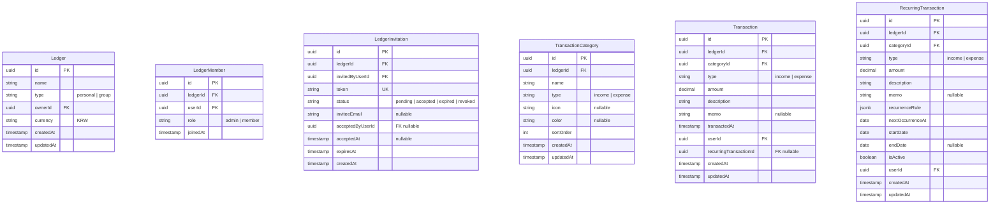
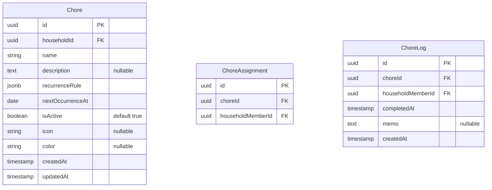
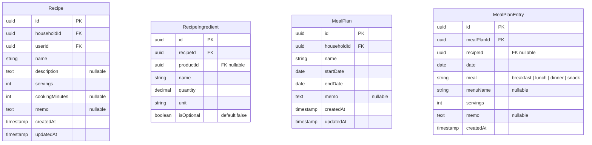
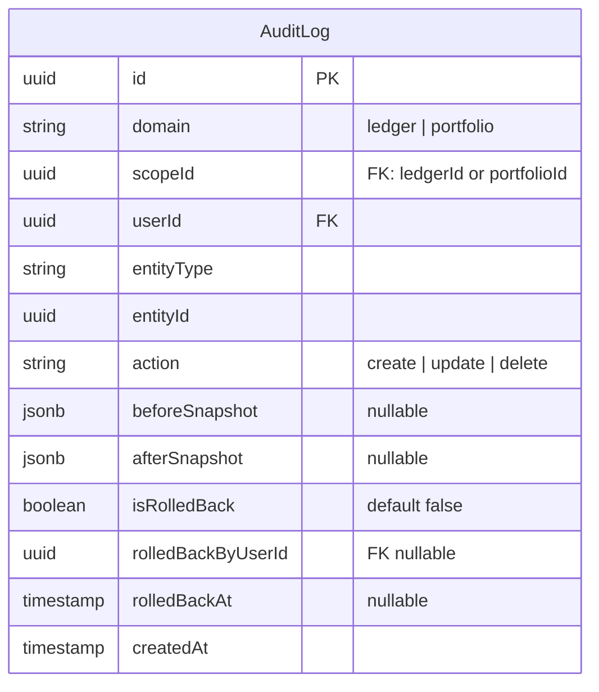

# 논리적 설계 — 가계부·투자 포트폴리오·집안일·식단 (ERD·구현용)

**버전**: v1.1 — 집안일·식단 도메인 추가 (2026-04-03)

> **가전/설비 관리**는 `docs/design/v2/` (v2.7)로 이동했습니다.

**관련 문서**:
- [개념적 설계](./entity-conceptual-design.md)
- [참고 내용 (실시간 협업·자산 API 등)](./reference.md)
- [집비치기 논리적 설계](../design/v2/entity-logical-design.md)

> 구현 시 FK·테이블명은 TypeORM 기준으로 조정 가능합니다.

---

## 논리적 ERD — 엔티티 관계 (카디널리티)

```mermaid
erDiagram
    User ||--o{ LedgerMember : "userId"
    Ledger ||--o{ LedgerMember : "ledgerId"
    Ledger ||--o{ LedgerInvitation : "ledgerId"
    User ||--o{ LedgerInvitation : "invitedByUserId"

    Ledger ||--o{ TransactionCategory : "ledgerId"
    Ledger ||--o{ Transaction : "ledgerId"
    Ledger ||--o{ RecurringTransaction : "ledgerId"
    TransactionCategory ||--o{ Transaction : "categoryId"
    TransactionCategory ||--o{ RecurringTransaction : "categoryId"
    RecurringTransaction ||--o{ Transaction : "recurringTransactionId"
    User ||--o{ Transaction : "userId"
    User ||--o{ RecurringTransaction : "userId"

    User ||--o{ PortfolioMember : "userId"
    Portfolio ||--o{ PortfolioMember : "portfolioId"
    Portfolio ||--o{ PortfolioInvitation : "portfolioId"
    User ||--o{ PortfolioInvitation : "invitedByUserId"

    Portfolio ||--o{ PortfolioHolding : "portfolioId"
    Asset ||--o{ PortfolioHolding : "assetId"
    Asset ||--o{ AssetPriceCache : "assetId"
    PortfolioHolding ||--o{ PortfolioTransaction : "holdingId"
    User ||--o{ PortfolioTransaction : "userId"

    Ledger ||--o{ AuditLog : "scopeId"
    Portfolio ||--o{ AuditLog : "scopeId"
    User ||--o{ AuditLog : "userId"

    Household ||--o{ Chore : "householdId"
    Chore ||--o{ ChoreAssignment : "choreId"
    HouseholdMember ||--o{ ChoreAssignment : "householdMemberId"
    Chore ||--o{ ChoreLog : "choreId"
    HouseholdMember ||--o{ ChoreLog : "householdMemberId"

    Household ||--o{ Recipe : "householdId"
    User ||--o{ Recipe : "userId"
    Recipe ||--o{ RecipeIngredient : "recipeId"
    Product ||--o{ RecipeIngredient : "productId"
    Household ||--o{ MealPlan : "householdId"
    MealPlan ||--o{ MealPlanEntry : "mealPlanId"
    Recipe ||--o{ MealPlanEntry : "recipeId"
```



---

## 논리적 ERD — 주요 엔티티 속성 (PK·FK)

### 가계부



### 투자 포트폴리오

```mermaid
erDiagram
    Portfolio {
        uuid id PK
        string name
        string type "personal | group"
        uuid ownerId FK
        string baseCurrency "KRW"
        timestamp createdAt
        timestamp updatedAt
    }
    PortfolioMember {
        uuid id PK
        uuid portfolioId FK
        uuid userId FK
        string role "admin | member"
        timestamp joinedAt
    }
    PortfolioInvitation {
        uuid id PK
        uuid portfolioId FK
        uuid invitedByUserId FK
        string token UK
        string status "pending | accepted | expired | revoked"
        string inviteeEmail "nullable"
        uuid acceptedByUserId "FK nullable"
        timestamp acceptedAt "nullable"
        timestamp expiresAt
        timestamp createdAt
    }
    Asset {
        uuid id PK
        string symbol
        string name
        string assetType "stock | etf | crypto | reit | bond | fund | other"
        string exchange "nullable"
        string currency
        string country "nullable"
        timestamp lastPriceUpdatedAt "nullable"
        timestamp createdAt
        timestamp updatedAt
    }
    AssetPriceCache {
        uuid id PK
        uuid assetId FK
        decimal price
        string currency
        decimal changePercent "nullable"
        timestamp fetchedAt
    }
    PortfolioHolding {
        uuid id PK
        uuid portfolioId FK
        uuid assetId FK
        decimal quantity
        decimal averageCostBasis
        string memo "nullable"
        timestamp createdAt
        timestamp updatedAt
    }
    PortfolioTransaction {
        uuid id PK
        uuid holdingId FK
        string type "buy | sell | dividend"
        decimal quantity
        decimal pricePerUnit
        decimal totalAmount
        decimal fee "nullable"
        timestamp transactedAt
        uuid userId FK
        string memo "nullable"
        timestamp createdAt
    }
```



### 집안일 관리



### 식단/레시피 관리



### 공용



---

## 테이블 상세

### §1 Ledger (가계부)

| 속성 | 타입 | 필수/선택 | 제약 | 비고 |
|------|------|----------|------|------|
| id | uuid | 필수 | PK | — |
| name | varchar(100) | 필수 | — | 가계부 이름 |
| type | varchar(20) | 필수 | CHECK(`personal`, `group`) | 개인/그룹 |
| ownerId | uuid | 필수 | FK (User.id) | 생성자 = 최초 관리자 |
| currency | varchar(10) | 필수 | — | 기본 통화 (기본값: `KRW`) |
| createdAt | timestamptz | 필수 | — | — |
| updatedAt | timestamptz | 필수 | — | — |

### §2 LedgerMember (가계부 멤버십)

| 속성 | 타입 | 필수/선택 | 제약 | 비고 |
|------|------|----------|------|------|
| id | uuid | 필수 | PK | — |
| ledgerId | uuid | 필수 | FK (Ledger.id) | — |
| userId | uuid | 필수 | FK (User.id) | — |
| role | varchar(20) | 필수 | CHECK(`admin`, `member`) | 관리자는 ledger당 1명만 |
| joinedAt | timestamptz | 필수 | — | — |

> UK: `(ledgerId, userId)` — 동일 가계부에 중복 가입 방지

### §3 LedgerInvitation (가계부 초대)

| 속성 | 타입 | 필수/선택 | 제약 | 비고 |
|------|------|----------|------|------|
| id | uuid | 필수 | PK | — |
| ledgerId | uuid | 필수 | FK (Ledger.id) | — |
| invitedByUserId | uuid | 필수 | FK (User.id) | — |
| token | varchar(255) | 필수 | UK | URL 포함 고유 토큰 |
| status | varchar(20) | 필수 | CHECK(`pending`, `accepted`, `expired`, `revoked`) | — |
| inviteeEmail | varchar(255) | 선택 | — | 지정 시 해당 이메일만 수락 |
| acceptedByUserId | uuid | 선택 | FK (User.id) | — |
| acceptedAt | timestamptz | 선택 | — | — |
| expiresAt | timestamptz | 필수 | — | — |
| createdAt | timestamptz | 필수 | — | — |

### §4 TransactionCategory (거래 분류)

| 속성 | 타입 | 필수/선택 | 제약 | 비고 |
|------|------|----------|------|------|
| id | uuid | 필수 | PK | — |
| ledgerId | uuid | 필수 | FK (Ledger.id) | — |
| name | varchar(50) | 필수 | — | — |
| type | varchar(20) | 필수 | CHECK(`income`, `expense`) | — |
| icon | varchar(50) | 선택 | — | 아이콘 식별자 |
| color | varchar(20) | 선택 | — | HEX 색상 |
| sortOrder | int | 필수 | — | 기본값 0 |
| createdAt | timestamptz | 필수 | — | — |
| updatedAt | timestamptz | 필수 | — | — |

### §5 Transaction (거래 내역)

| 속성 | 타입 | 필수/선택 | 제약 | 비고 |
|------|------|----------|------|------|
| id | uuid | 필수 | PK | — |
| ledgerId | uuid | 필수 | FK (Ledger.id) | — |
| categoryId | uuid | 필수 | FK (TransactionCategory.id) | — |
| type | varchar(20) | 필수 | CHECK(`income`, `expense`) | — |
| amount | decimal(15,2) | 필수 | — | 항상 양수 |
| description | varchar(200) | 필수 | — | 거래 설명 |
| memo | text | 선택 | — | — |
| transactedAt | timestamptz | 필수 | — | 실제 거래 일시 |
| userId | uuid | 필수 | FK (User.id) | 작성자 |
| recurringTransactionId | uuid | 선택 | FK (RecurringTransaction.id) | 자동 생성 출처 |
| createdAt | timestamptz | 필수 | — | — |
| updatedAt | timestamptz | 필수 | — | — |

### §6 RecurringTransaction (정기 거래)

| 속성 | 타입 | 필수/선택 | 제약 | 비고 |
|------|------|----------|------|------|
| id | uuid | 필수 | PK | — |
| ledgerId | uuid | 필수 | FK (Ledger.id) | — |
| categoryId | uuid | 필수 | FK (TransactionCategory.id) | — |
| type | varchar(20) | 필수 | CHECK(`income`, `expense`) | — |
| amount | decimal(15,2) | 필수 | — | 항상 양수 |
| description | varchar(200) | 필수 | — | 예: "넷플릭스", "월급" |
| memo | text | 선택 | — | — |
| recurrenceRule | jsonb | 필수 | — | 반복 규칙 (아래 참조) |
| nextOccurrenceAt | date | 필수 | — | 다음 발생 예정일 |
| startDate | date | 필수 | — | 반복 시작일 |
| endDate | date | 선택 | — | 미지정 시 무기한 |
| isActive | boolean | 필수 | — | 기본값 true |
| userId | uuid | 필수 | FK (User.id) | 작성자 |
| createdAt | timestamptz | 필수 | — | — |
| updatedAt | timestamptz | 필수 | — | — |

**recurrenceRule JSONB 스키마**:
```typescript
interface RecurrenceRule {
  frequency: 'daily' | 'weekly' | 'monthly' | 'yearly';
  interval: number;        // 반복 간격 (1 = 매번, 2 = 2번째마다, ...)
  dayOfMonth?: number;     // 1~31 (monthly/yearly)
  dayOfWeek?: number;      // 0(일)~6(토) (weekly)
  monthOfYear?: number;    // 1~12 (yearly)
}
```

| 사용 예시 | frequency | interval | dayOfMonth | dayOfWeek | monthOfYear |
|-----------|-----------|----------|------------|-----------|-------------|
| 매일 | `daily` | 1 | — | — | — |
| 매주 월요일 | `weekly` | 1 | — | 1 | — |
| 매월 17일 | `monthly` | 1 | 17 | — | — |
| 3개월마다 1일 | `monthly` | 3 | 1 | — | — |
| 매년 3월 15일 | `yearly` | 1 | 15 | — | 3 |

### §7 Portfolio (투자 포트폴리오)

| 속성 | 타입 | 필수/선택 | 제약 | 비고 |
|------|------|----------|------|------|
| id | uuid | 필수 | PK | — |
| name | varchar(100) | 필수 | — | — |
| type | varchar(20) | 필수 | CHECK(`personal`, `group`) | — |
| ownerId | uuid | 필수 | FK (User.id) | 생성자 = 최초 관리자 |
| baseCurrency | varchar(10) | 필수 | — | 기본값: `KRW` |
| createdAt | timestamptz | 필수 | — | — |
| updatedAt | timestamptz | 필수 | — | — |

### §8 PortfolioMember (포트폴리오 멤버십)

| 속성 | 타입 | 필수/선택 | 제약 | 비고 |
|------|------|----------|------|------|
| id | uuid | 필수 | PK | — |
| portfolioId | uuid | 필수 | FK (Portfolio.id) | — |
| userId | uuid | 필수 | FK (User.id) | — |
| role | varchar(20) | 필수 | CHECK(`admin`, `member`) | 관리자는 portfolio당 1명만 |
| joinedAt | timestamptz | 필수 | — | — |

> UK: `(portfolioId, userId)`

### §9 PortfolioInvitation (포트폴리오 초대)

| 속성 | 타입 | 필수/선택 | 제약 | 비고 |
|------|------|----------|------|------|
| id | uuid | 필수 | PK | — |
| portfolioId | uuid | 필수 | FK (Portfolio.id) | — |
| invitedByUserId | uuid | 필수 | FK (User.id) | — |
| token | varchar(255) | 필수 | UK | — |
| status | varchar(20) | 필수 | CHECK(`pending`, `accepted`, `expired`, `revoked`) | — |
| inviteeEmail | varchar(255) | 선택 | — | — |
| acceptedByUserId | uuid | 선택 | FK (User.id) | — |
| acceptedAt | timestamptz | 선택 | — | — |
| expiresAt | timestamptz | 필수 | — | — |
| createdAt | timestamptz | 필수 | — | — |

### §10 Asset (자산 마스터)

| 속성 | 타입 | 필수/선택 | 제약 | 비고 |
|------|------|----------|------|------|
| id | uuid | 필수 | PK | — |
| symbol | varchar(30) | 필수 | — | 예: AAPL, BTC, 005930.KS |
| name | varchar(200) | 필수 | — | — |
| assetType | varchar(20) | 필수 | CHECK(`stock`, `etf`, `crypto`, `reit`, `bond`, `fund`, `other`) | — |
| exchange | varchar(50) | 선택 | — | NYSE, KOSPI, Binance 등 |
| currency | varchar(10) | 필수 | — | 해당 자산의 거래 통화 |
| country | varchar(10) | 선택 | — | ISO 3166-1 alpha-2 |
| lastPriceUpdatedAt | timestamptz | 선택 | — | — |
| createdAt | timestamptz | 필수 | — | — |
| updatedAt | timestamptz | 필수 | — | — |

> UK: `(symbol, exchange)` — 동일 거래소 내 심볼 중복 방지. exchange가 NULL인 경우(코인 등) symbol만으로 구분.

### §11 AssetPriceCache (자산 시세 캐시)

| 속성 | 타입 | 필수/선택 | 제약 | 비고 |
|------|------|----------|------|------|
| id | uuid | 필수 | PK | — |
| assetId | uuid | 필수 | FK (Asset.id) | — |
| price | decimal(20,8) | 필수 | — | 소수점 8자리 (코인 대응) |
| currency | varchar(10) | 필수 | — | — |
| changePercent | decimal(8,4) | 선택 | — | 일일 변동률(%) |
| fetchedAt | timestamptz | 필수 | — | 시세 조회 시각 |

> 자산별 최신 1행만 유지 (upsert). 과거 시세 이력이 필요하면 별도 테이블 확장.

### §12 PortfolioHolding (보유 자산)

| 속성 | 타입 | 필수/선택 | 제약 | 비고 |
|------|------|----------|------|------|
| id | uuid | 필수 | PK | — |
| portfolioId | uuid | 필수 | FK (Portfolio.id) | — |
| assetId | uuid | 필수 | FK (Asset.id) | — |
| quantity | decimal(20,8) | 필수 | — | 보유 수량 |
| averageCostBasis | decimal(20,8) | 필수 | — | 평균 매입 단가 |
| memo | text | 선택 | — | — |
| createdAt | timestamptz | 필수 | — | — |
| updatedAt | timestamptz | 필수 | — | — |

> UK: `(portfolioId, assetId)` — 포트폴리오당 동일 자산 1행

### §13 PortfolioTransaction (매매·배당 기록)

| 속성 | 타입 | 필수/선택 | 제약 | 비고 |
|------|------|----------|------|------|
| id | uuid | 필수 | PK | — |
| holdingId | uuid | 필수 | FK (PortfolioHolding.id) | — |
| type | varchar(20) | 필수 | CHECK(`buy`, `sell`, `dividend`) | — |
| quantity | decimal(20,8) | 필수 | — | — |
| pricePerUnit | decimal(20,8) | 필수 | — | — |
| totalAmount | decimal(20,2) | 필수 | — | — |
| fee | decimal(15,2) | 선택 | — | 수수료 |
| transactedAt | timestamptz | 필수 | — | — |
| userId | uuid | 필수 | FK (User.id) | 작성자 |
| memo | text | 선택 | — | — |
| createdAt | timestamptz | 필수 | — | — |

### §14 AuditLog (감사 로그)

| 속성 | 타입 | 필수/선택 | 제약 | 비고 |
|------|------|----------|------|------|
| id | uuid | 필수 | PK | — |
| domain | varchar(20) | 필수 | CHECK(`ledger`, `portfolio`) | — |
| scopeId | uuid | 필수 | — | ledgerId 또는 portfolioId (FK 제약 없음, 느슨한 참조) |
| userId | uuid | 필수 | FK (User.id) | 작업 수행자 |
| entityType | varchar(50) | 필수 | — | 예: `Transaction`, `PortfolioHolding` |
| entityId | uuid | 필수 | — | 대상 엔티티 PK |
| action | varchar(20) | 필수 | CHECK(`create`, `update`, `delete`) | — |
| beforeSnapshot | jsonb | 선택 | — | update·delete 시 변경 전 상태 |
| afterSnapshot | jsonb | 선택 | — | create·update 시 변경 후 상태 |
| isRolledBack | boolean | 필수 | — | 기본값 false |
| rolledBackByUserId | uuid | 선택 | FK (User.id) | — |
| rolledBackAt | timestamptz | 선택 | — | — |
| createdAt | timestamptz | 필수 | — | — |

> 인덱스 권장: `(domain, scopeId, createdAt)` — 특정 가계부/포트폴리오의 로그 시간순 조회

### §15 Chore (집안일)

| 속성 | 타입 | 필수/선택 | 제약 | 비고 |
|------|------|----------|------|------|
| id | uuid | 필수 | PK | — |
| householdId | uuid | 필수 | FK (Household.id) | — |
| name | varchar(100) | 필수 | — | 예: "거실 청소" |
| description | text | 선택 | — | — |
| recurrenceRule | jsonb | 필수 | — | 동일 JSONB 구조 |
| nextOccurrenceAt | date | 필수 | — | 다음 예정일 |
| isActive | boolean | 필수 | — | 기본값 true |
| icon | varchar(50) | 선택 | — | 아이콘 식별자 |
| color | varchar(20) | 선택 | — | HEX 색상 |
| createdAt | timestamptz | 필수 | — | — |
| updatedAt | timestamptz | 필수 | — | — |

### §16 ChoreAssignment (가사 담당자 할당)

| 속성 | 타입 | 필수/선택 | 제약 | 비고 |
|------|------|----------|------|------|
| id | uuid | 필수 | PK | — |
| choreId | uuid | 필수 | FK (Chore.id) | — |
| householdMemberId | uuid | 필수 | FK (HouseholdMember.id) | — |

> UK: `(choreId, householdMemberId)` — 동일 가사에 중복 할당 방지

### §17 ChoreLog (가사 완료 기록)

| 속성 | 타입 | 필수/선택 | 제약 | 비고 |
|------|------|----------|------|------|
| id | uuid | 필수 | PK | — |
| choreId | uuid | 필수 | FK (Chore.id) | — |
| householdMemberId | uuid | 필수 | FK (HouseholdMember.id) | 수행자 |
| completedAt | timestamptz | 필수 | — | 완료 일시 |
| memo | text | 선택 | — | — |
| createdAt | timestamptz | 필수 | — | — |

> 완료 시 Chore.nextOccurrenceAt을 recurrenceRule에 따라 갱신

### §18 Recipe (레시피)

| 속성 | 타입 | 필수/선택 | 제약 | 비고 |
|------|------|----------|------|------|
| id | uuid | 필수 | PK | — |
| householdId | uuid | 필수 | FK (Household.id) | — |
| userId | uuid | 필수 | FK (User.id) | 작성자 |
| name | varchar(100) | 필수 | — | 예: "김치찌개" |
| description | text | 선택 | — | — |
| servings | int | 필수 | — | 기준 인분 수 (기본값: 1) |
| cookingMinutes | int | 선택 | — | 조리 시간(분) |
| memo | text | 선택 | — | — |
| createdAt | timestamptz | 필수 | — | — |
| updatedAt | timestamptz | 필수 | — | — |

### §19 RecipeIngredient (레시피 재료)

| 속성 | 타입 | 필수/선택 | 제약 | 비고 |
|------|------|----------|------|------|
| id | uuid | 필수 | PK | — |
| recipeId | uuid | 필수 | FK (Recipe.id) | — |
| productId | uuid | 선택 | FK (Product.id) | 재고 도메인 제품 연결 |
| name | varchar(100) | 필수 | — | 재료명 (Product 없을 시 자유 입력) |
| quantity | decimal(10,2) | 필수 | — | 필요 수량 |
| unit | varchar(20) | 필수 | — | 예: "g", "ml", "개" |
| isOptional | boolean | 필수 | — | 기본값 false |

> productId가 있으면 InventoryItem과 비교하여 부족 재료 산출 가능

### §20 MealPlan (식단 계획)

| 속성 | 타입 | 필수/선택 | 제약 | 비고 |
|------|------|----------|------|------|
| id | uuid | 필수 | PK | — |
| householdId | uuid | 필수 | FK (Household.id) | — |
| name | varchar(100) | 필수 | — | 예: "4월 1주차" |
| startDate | date | 필수 | — | — |
| endDate | date | 필수 | — | — |
| memo | text | 선택 | — | — |
| createdAt | timestamptz | 필수 | — | — |
| updatedAt | timestamptz | 필수 | — | — |

### §21 MealPlanEntry (식단 항목)

| 속성 | 타입 | 필수/선택 | 제약 | 비고 |
|------|------|----------|------|------|
| id | uuid | 필수 | PK | — |
| mealPlanId | uuid | 필수 | FK (MealPlan.id) | — |
| recipeId | uuid | 선택 | FK (Recipe.id) | 레시피 연결 |
| date | date | 필수 | — | — |
| meal | varchar(20) | 필수 | CHECK(`breakfast`, `lunch`, `dinner`, `snack`) | — |
| menuName | varchar(100) | 선택 | — | 레시피 없이 직접 입력 |
| servings | int | 필수 | — | 기본값 1 |
| memo | text | 선택 | — | — |
| createdAt | timestamptz | 필수 | — | — |

> UK: `(mealPlanId, date, meal)` — 같은 계획 내 동일 날짜·끼니 중복 방지

---

## 설계 결정 사항

| # | 항목 | 결정 | 근거 |
|---|------|------|------|
| 1 | 계정 | 집비치기 User 엔티티 공유 | 별도 회원가입 불필요, 모듈러 모놀리스 구조 |
| 2 | 개인/그룹 구분 | Ledger.type, Portfolio.type으로 구분 | 테이블 분리보다 단순, 조건 분기로 처리 |
| 3 | 그룹 관리자 | 그룹당 1명, role='admin' | 양도 = 기존 admin→member + 대상 member→admin 트랜잭션 |
| 4 | 멤버 권한 | 모든 멤버 CRUD 가능, 관리자만 롤백 | RolesGuard 재활용 가능 |
| 5 | 감사 로그 | 가계부·포트폴리오 공용 AuditLog | domain+scopeId로 구분, 테이블 증가 억제 |
| 6 | 롤백 | beforeSnapshot 기반 엔티티 복원 | 롤백 자체도 AuditLog 기록 |
| 7 | 정기 거래 반복 규칙 | JSONB (recurrenceRule) | RRULE보다 단순, 필요 시 확장 가능 |
| 8 | 자산 시세 | 캐시 테이블 + 외부 API | TTL 기반 갱신, API 호출 최소화 |
| 9 | 실시간 동기화 | 그룹 가계부만 적용, WebSocket 기반 | 포트폴리오는 실시간 불필요 |
| 10 | 알림 | 기존 Notification 엔티티 재활용 | type 필드로 가계부 알림 구분 |
| 11 | 반복 규칙 공유 | recurrenceRule JSONB 구조를 Chore에서도 재활용 | 도메인 간 일관성 확보, 스케줄러 로직 공유 가능 |
| 12 | 레시피 재료 연동 | RecipeIngredient.productId로 재고 Product 선택적 연결 | productId nullable — 연결 없이도 자유 입력 가능, 연결 시 재고 비교 자동화 |
| 13 | 가사 담당자 | HouseholdMember FK 사용 (User FK가 아님) | Household 맥락 내에서의 역할·구성원 추적 일관성 |
| 14 | 식단 끼니 중복 | MealPlanEntry에 `(mealPlanId, date, meal)` UK | 같은 끼니에 중복 등록 방지. 간식은 별도 meal 타입으로 허용 |
