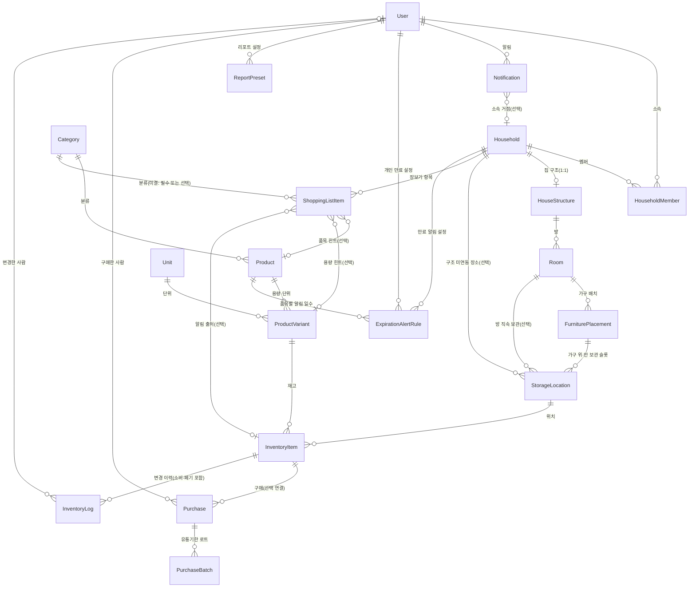

# 개념적 설계 v2 — 엔티티와 속성

**버전**: v2 — 프론트 구현 피드백 반영 (2026-03-26)

**v1 대비 주요 변경**:
- Consumption, WasteRecord 제거 → InventoryLog로 통합
- ShoppingList 제거 → ShoppingListItem이 Household에 직접 연결
- Household에 `거점 유형(kind)` 추가
- Purchase에 `구매처 이름`, `inventoryItemId 선택`, `품목명 스냅샷 3필드` 추가
- Notification에 `소속 가족·공유 그룹` 추가

**v1 원본**: [v1/entity-conceptual-design.md](../v1/entity-conceptual-design.md)
**다음 단계**: 속성의 제약·타입·식별·관계는 [엔티티 논리적 설계 v2](./entity-logical-design.md)에서 다룹니다.

---

## 개념적 ERD (엔티티 간 관계)

---

## User (사용자)

- 이메일
- 비밀번호(인증용 저장값)
- 표시 이름
- 이메일 인증 완료 시각(미인증 시 NULL)
- 마지막 로그인 시각

---

## Household (가족·공유 그룹)

- 그룹 이름
- **거점 유형(kind)** — home, office, vehicle, other + 사용자 정의 **(v2 추가)**

---

## HouseholdMember (멤버십, 연관 테이블)

- 사용자 (userId)
- 가족·공유 그룹 (householdId)
- 역할(소유자, 멤버 등)
- 가입 시각 (joinedAt)

---

## Category (카테고리)

- 이름
- 정렬 순서

> **플랫(1단계)** 목록만 사용, 상위·하위 계층 없음.

---

## HouseStructure (집 구조)

- 소속 가족·공유 그룹 (Household 1:1)
- 구조 이름 (예: "우리 집")
- 구조 데이터 (방·슬롯 정의, JSONB)
- **구조도 레이아웃** (2D 좌표, JSONB) **(v2 추가)**
- (선택) 스키마 버전

---

## Room (방)

- 소속 집 구조 (HouseStructure)
- 방 키(JSON 내 room id와 동일)
- 표시 이름(선택)
- 정렬 순서

---

## FurniturePlacement (가구 배치)

- 소속 방 (Room)
- 배치 이름 또는 별칭
- (선택) 가구 상품·변형 — Product / ProductVariant
- **대표 보관 슬롯** (UI 앵커링용) **(v2 추가)**
- 정렬 순서
- (선택) 배치 메타 — 3D 좌표·회전 등

---

## StorageLocation (보관 장소 / 보관 슬롯)

- 소속 가족·공유 그룹
- 장소 이름
- 정렬 순서
- (선택) 방 — Room
- (선택) 가구 배치 — FurniturePlacement

---

## Unit (단위)

- 단위 기호(예: ml, g, 개)
- 표시 이름
- 정렬 순서

---

## Product (상품)

- 카테고리
- 상품 이름
- 상품 이미지(URL, 선택)
- 설명(선택)
- isConsumable(소비형 vs 사용형)

---

## ProductVariant (상품 용량·포장 단위)

- 상품
- 단위
- 단위당 수량
- 표시용 이름
- 참고 단가(price, 선택)
- SKU(선택)
- 대표 용량 여부

---

## InventoryItem (재고 품목)

- 상품 변형
- 보관 장소
- 현재 수량
- 최소 재고 기준(잔량 부족 알림용)

---

## Purchase (구매 기록)

- 재고 품목 **(v2 변경: 선택 — 구매만 먼저, 재고 연결은 나중에)**
- 구매 수량
- 구매 일시
- 단가
- 총액
- **구매처 이름(선택)** **(v2 추가)** — 1차 수기 입력, Supplier 테이블은 통계 기능 시 추가 예정
- **품목명 스냅샷** **(v2 추가)** — 품목 삭제 시에도 구매 내역 표시용 (itemName, variantCaption, unitSymbol)
- 메모
- 구매 수행 사용자(선택)

---

## PurchaseBatch (유통기한 로트)

- 구매 기록
- 로트 수량
- 유통기한

---

## InventoryLog (재고 변경 이력) — v2 통합

> **v2 변경**: v1의 Consumption(소비 기록) + WasteRecord(폐기 기록)을 통합.

- 재고 품목
- 변경 유형(입고, 소비, 조정, 폐기)
- 수량 변화
- 변경 후 수량
- **폐기 사유**(type=waste 시, 선택) **(v2 추가)**
- **품목명 스냅샷**(조회 편의용, 선택) **(v2 추가)**
- 관련 기록 참조(어떤 구매와 연결됐는지)
- 발생 시각
- 메모
- 변경한 사용자(선택)

### v1에서 제거된 엔티티 매핑

| v1 엔티티 | v2 대체 | 매핑 |
|-----------|---------|------|
| Consumption (소비 기록) | InventoryLog | type='out', 소비 수량 → quantityDelta(음수) |
| WasteRecord (폐기 기록) | InventoryLog | type='waste', reason 필드에 사유 |

---

## ShoppingListItem (장보기 항목) — v2 변경

> **v2 변경**: ShoppingList(부모) 제거. Household에 직접 연결. checked 제거 (구매 완료 시 행 삭제).

- **소속 가족·공유 그룹** (v1: 장보기 리스트 → v2: Household 직접)
- 카테고리 **(v2 변경: nullable)** — 현재 프론트는 항상 채우지만, 자유 텍스트 장보기 항목 확장 대비
- (선택) 상품·상품 변형 — 부족/만료 알림에서 넘어오면 제안값
- (선택) 알림이 가리킨 재고 품목
- **(선택) 넣을 칸 힌트** — 보관 장소 **(v2 추가)**
- 수량(대략)
- 정렬 순서
- 메모

### v1에서 제거된 엔티티

| v1 엔티티 | 사유 |
|-----------|------|
| ShoppingList (장보기 리스트) | 프론트에 리스트 이름·마감일·상태 개념이 없음. 장보기 항목이 Household에 직접 연결 |

---

## Notification (알림)

- 수신 사용자
- **소속 가족·공유 그룹(선택)** **(v2 추가)**
- 알림 유형
- 제목
- 본문
- 읽은 시각
- 관련 대상 참조

---

## ExpirationAlertRule (만료 알림 설정)

- 소유 주체(사용자 또는 가족·공유 그룹)
- 품목(Product)
- 유통기한 며칠 전 알림
- 활성 여부

---

## ReportPreset (리포트 설정)

- 사용자
- 설정 이름
- 설정 내용(필터, 기간 등)
- 정렬 순서

> 1차 개발 범위 외 (P3).

---

## 개념적 설계 메모

- **v2 통합 결정**: 소비(Consumption)·폐기(WasteRecord)를 InventoryLog 하나로 합쳤다. 이력 조회가 단일 테이블로 가능하고, 프론트 `InventoryLedgerRow` 타입과 1:1 대응.
- **v2 구조 단순화**: 장보기 리스트(ShoppingList)의 부모-자식 2단 구조를 제거하고, 항목(ShoppingListItem)이 Household에 직접 연결. 프론트에 리스트 이름·마감일 개념이 없었기 때문.
- **위치 계층(권장)**: `Room`(방) → `FurniturePlacement`(가구 배치) → `StorageLocation`(보관 슬롯) → `InventoryItem`(물품·재고).
- **알림 → 장보기 → 재고**: 만료 임박·재고 부족 → 장보기에 항목 추가 → 구매 완료 시 Purchase·InventoryItem 반영 + 장보기 행 삭제.

---

*본 문서는 [frontend-backend-alignment.md](../backend/docs/frontend-backend-alignment.md) §1 결정에 따라 v1에서 갱신되었습니다.*
