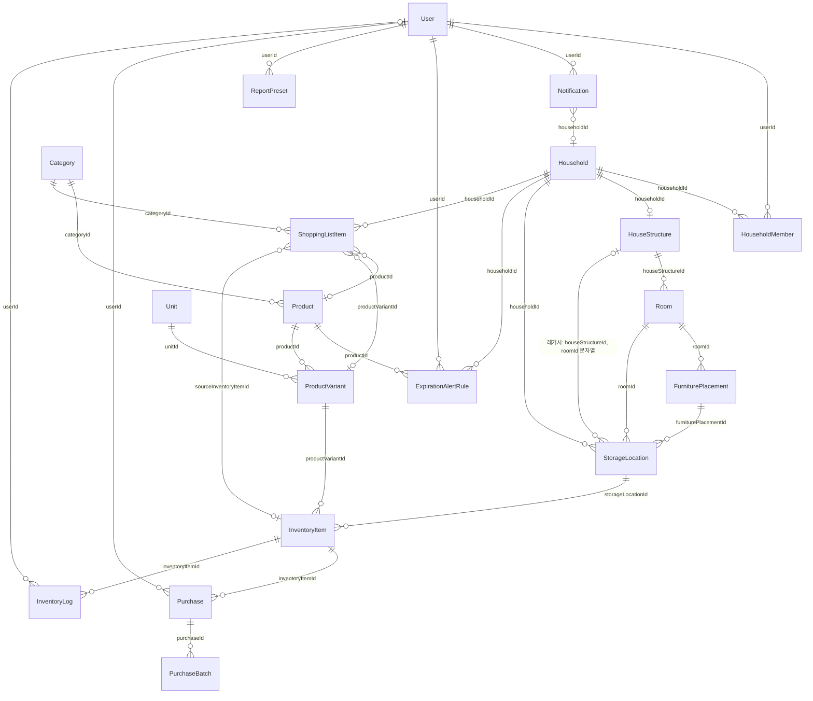
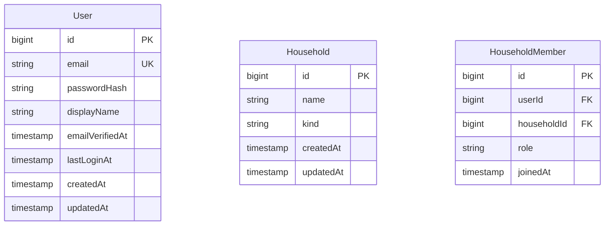
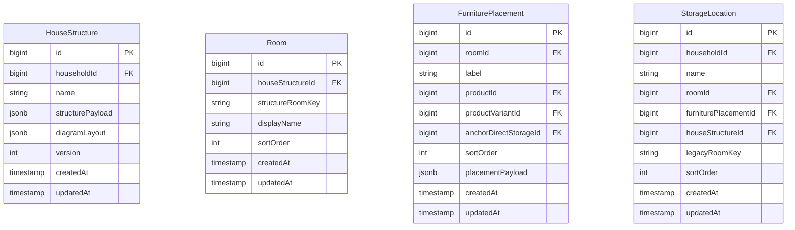
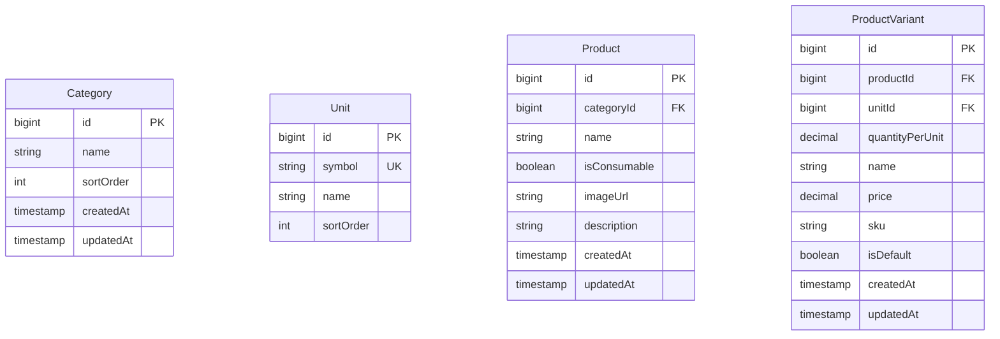
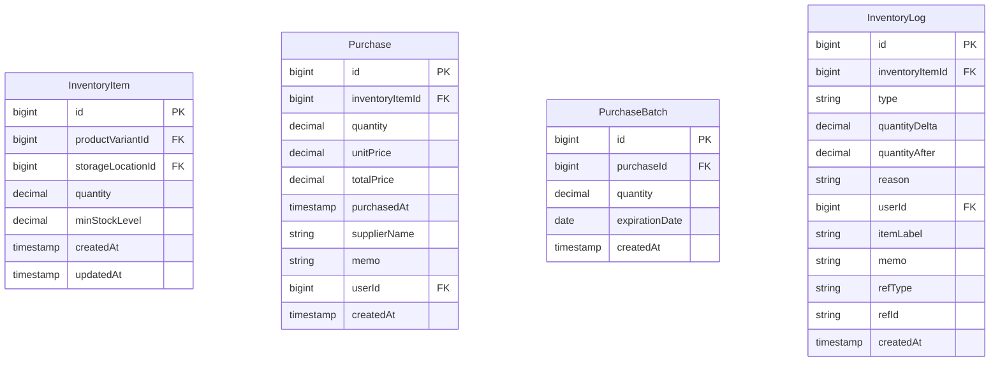
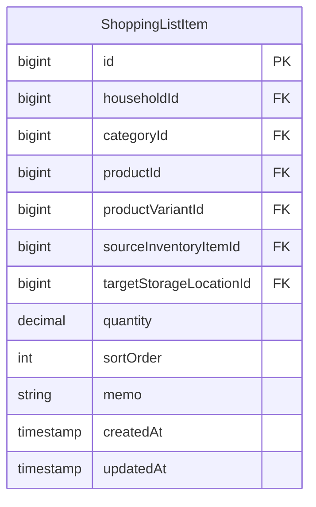
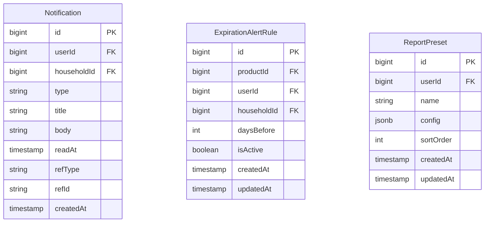

# 엔티티 논리적 설계 v2 (ERD·구현용)

**버전**: v2 — 프론트 구현 피드백 반영 (2026-03-26)

**v1 대비 주요 변경**:
- Consumption(§14), WasteRecord(§16) 제거 → InventoryLog(§15)로 통합
- ShoppingList(§17) 제거 → ShoppingListItem이 Household에 직접 연결
- ShoppingListItem.checked 제거 (구매 완료 시 행 삭제)
- Purchase.inventoryItemId nullable로 변경
- Purchase.supplierName 추가
- Notification.householdId 추가
- 변경 근거: [frontend-backend-alignment.md](../backend/docs/frontend-backend-alignment.md) §1 참조

**상위 문서**: [개념적 설계 v2](./entity-conceptual-design.md)
**v1 원본**: [v1/entity-logical-design.md](../v1/entity-logical-design.md)

---

## 논리적 ERD — 엔티티 관계 (카디널리티)

> 구현 시 FK·테이블명은 TypeORM 기준으로 조정 가능합니다.

---

## 논리적 ERD — 주요 엔티티 속성 (PK·FK)

> Mermaid 블록은 **다이어그램용 속성 요약**입니다. **정본(필수/선택·비고·제약)** 은 아래 §1~§19 표를 따릅니다.

### 인증·가족·공유 그룹

### 집 구조·방·가구 배치·보관 장소

- **HouseStructure**: `householdId`는 **Household당 1건**(unique, 1:1). **v2 추가**: `diagramLayout`(구조도 2D 좌표, jsonb).
- **Room**: `(houseStructureId, structureRoomKey)` **유일** 권장(JSON room id와 1:1 대응).
- **FurniturePlacement**: `productId`·`productVariantId`는 **선택**(가구를 마스터에 안 올린 경우 라벨만으로 운용 가능). **v2 추가**: `anchorDirectStorageId`(대표 보관 슬롯 FK, nullable).

### 카테고리·단위·상품 마스터

### 재고·구매·이력

- **Purchase**: **v2 변경** — `inventoryItemId` **nullable** (구매만 먼저 기록, 재고 연결은 나중에). `supplierName` **추가** (구매처, nullable).
- **InventoryLog**: **v2 변경** — Consumption·WasteRecord 통합. `type: 'in' | 'out' | 'adjust' | 'waste'`. `reason`(폐기 사유, nullable), `itemLabel`(품목명 스냅샷, nullable) **추가**.

### 장보기

- **v2 변경**: ShoppingList(부모) 테이블 제거. `shoppingListId FK` → `householdId FK`로 변경. `checked` 컬럼 제거 (구매 완료 시 행 삭제). `targetStorageLocationId` **추가** (넣을 칸 힌트, nullable).
- **`categoryId`**: v1에서는 필수. **nullable 여부 미결정** — [frontend-backend-alignment.md §2-11](../backend/docs/frontend-backend-alignment.md) 참조.

### 알림·만료 규칙·리포트

- **Notification**: **v2 추가** — `householdId FK nullable`. 프론트는 householdId 기준으로 필터. userId도 유지.
- **ExpirationAlertRule**: `productId` **필수**. `userId`와 `householdId`는 **택1**(정확히 하나만 NOT NULL). **동일 소유·동일 품목** 중복 방지는 §18.

---

## 1. User (사용자)

| 구분     | 항목                 | 타입/비고            | 검토                                       |
| -------- | -------------------- | -------------------- | ------------------------------------------ |
| **필수** | id                   | PK, UUID 또는 bigint | —                                          |
| **필수** | email                | string, unique       | —                                          |
| **필수** | passwordHash         | string (bcrypt 등)   | —                                          |
| **선택** | displayName          | string               | 닉네임/표시 이름                           |
| **선택** | emailVerifiedAt      | timestamp, nullable  | 이메일 인증 완료 시각; **NULL이면 미인증** |
| **선택** | createdAt, updatedAt | timestamp            | 감사용                                     |
| **선택** | lastLoginAt          | timestamp            | —                                          |

**관계**: Household (N:N), Notification (1:N), ExpirationAlertRule (1:N), ReportPreset (1:N), Purchase·InventoryLog (선택 `userId`)

**이메일 검증**: 가입 시 인증 메일 발송 → 토큰(또는 링크) 검증 후 `emailVerifiedAt` 설정. 토큰 저장·만료는 별도 테이블 또는 캐시로 구현 가능.

---

## 2. Household (가족/공유 그룹)

| 구분     | 항목                 | 타입/비고        | 검토                                        |
| -------- | -------------------- | ---------------- | ------------------------------------------- |
| **필수** | id                   | PK               | —                                           |
| **필수** | name                 | string           | "우리 가족", "1인" 등 (가족·공유 그룹 이름) |
| **v2**   | **kind**             | string, nullable | **거점 유형** (home, office, vehicle, other + 사용자 정의) |
| **선택** | createdAt, updatedAt | timestamp        | —                                           |

**관계**: User (N:N, 연관 테이블 HouseholdMember), StorageLocation (1:N), ShoppingListItem (1:N), ExpirationAlertRule (1:N, 선택)

**연관 테이블 HouseholdMember** (User–Household N:N)
| 구분 | 항목 | 비고 |
|------|------|------|
| 필수 | userId, householdId | 복합 PK 또는 PK + unique |
| 선택 | role | 'owner' \| 'member' |
| 선택 | joinedAt | timestamp |

**API DTO**: HouseholdMember는 User를 join하여 `GroupMember`(id, email, role, label?) 형태로 반환 — [frontend-backend-alignment.md §1-4](../backend/docs/frontend-backend-alignment.md).

---

## 3. Category (대분류)

| 구분     | 항목                 | 타입/비고 | 검토                                                              |
| -------- | -------------------- | --------- | ----------------------------------------------------------------- |
| **필수** | id                   | PK        | —                                                                 |
| **필수** | name                 | string    | "식료품", "생활용품", "의약품", "전자제품", "식기류", "가구류" 등 |
| **선택** | sortOrder            | int       | 표시 순서                                                         |
| **선택** | createdAt, updatedAt | timestamp | —                                                                 |

**관계**: Product (1:N), ShoppingListItem (1:N) — **플랫(1단계) 카테고리만** 사용, 계층(parent) 없음.

---

## 4. HouseStructure (집 구조)

| 구분     | 항목                 | 타입/비고              | 검토                          |
| -------- | -------------------- | ---------------------- | ----------------------------- |
| **필수** | id                   | PK                     | —                             |
| **필수** | householdId          | FK → Household, unique | Household당 1개               |
| **필수** | name                 | string                 | "우리 집" 등                  |
| **필수** | structurePayload     | jsonb                  | 방·슬롯 정의(rooms, slots 등) |
| **v2**   | **diagramLayout**    | jsonb, nullable        | **구조도 2D 좌표** `Record<string, {x,y}>` |
| **선택** | version              | int                    | 스키마 버전                   |
| **선택** | createdAt, updatedAt | timestamp              | —                             |

**관계**: Household (1:1), Room (1:N)

**API DTO**: Household 응답에 flat 병합하여 rooms, furniturePlacements, storageLocations, items, structureDiagramLayout 포함 — [frontend-backend-alignment.md §1-1](../backend/docs/frontend-backend-alignment.md).

---

## 5. Room (방)

| 구분     | 항목                 | 타입/비고                        | 검토                                                         |
| -------- | -------------------- | -------------------------------- | ------------------------------------------------------------ |
| **필수** | id                   | PK                               | —                                                            |
| **필수** | houseStructureId     | FK → HouseStructure              | 소속 집 구조                                                 |
| **필수** | structureRoomKey     | string                           | `structurePayload` 내 room id와 **동일** (앱·3D와 동기)      |
| **선택** | displayName          | string, nullable                 | UI 표시명(JSON 라벨과 다를 때)                               |
| **선택** | sortOrder            | int                              | 방 목록 정렬                                                 |
| **선택** | createdAt, updatedAt | timestamp                        | —                                                            |

**관계**: HouseStructure (N:1), FurniturePlacement (1:N), StorageLocation (1:N, 방 직속 슬롯)

### 식별·제약 (권장)

- `(houseStructureId, structureRoomKey)` **유일**(UNIQUE) — 동일 집 구조 안에서 방 키 중복 방지.

---

## 6. FurniturePlacement (가구 배치)

| 구분     | 항목                       | 타입/비고                            | 검토                                                                 |
| -------- | -------------------------- | ------------------------------------ | -------------------------------------------------------------------- |
| **필수** | id                         | PK                                   | —                                                                    |
| **필수** | roomId                     | FK → Room                            | 이 가구가 놓인 방                                                  |
| **필수** | label                      | string                               | "책상", "침대 옆 협탁" 등                                          |
| **선택** | productId                  | FK → Product, nullable               | 가구 **종류**를 마스터와 연결할 때                                  |
| **선택** | productVariantId           | FK → ProductVariant, nullable        | 모델·규격까지 연결할 때                                            |
| **v2**   | **anchorDirectStorageId**  | FK → StorageLocation, nullable       | **대표 보관 슬롯** (UI 앵커링용)                                   |
| **선택** | sortOrder                  | int                                  | 방 안에서 가구 나열 순서                                           |
| **선택** | placementPayload           | jsonb, nullable                      | 3D 위치·회전 등                                                    |
| **선택** | createdAt, updatedAt       | timestamp                            | —                                                                    |

**관계**: Room (N:1), Product·ProductVariant (선택 N:1), StorageLocation (1:N)

---

## 7. StorageLocation (보관 장소)

| 구분     | 항목                    | 타입/비고                     | 검토                                                                                         |
| -------- | ----------------------- | ----------------------------- | -------------------------------------------------------------------------------------------- |
| **필수** | id                      | PK                            | —                                                                                            |
| **필수** | householdId             | FK → Household                | —                                                                                            |
| **필수** | name                    | string                        | "책상 서랍 왼쪽", "냉장고 문쪽", "선반 2단"                                                  |
| **선택** | roomId                  | FK → Room, nullable           | **방 직속** 보관                                                                             |
| **선택** | furniturePlacementId    | FK → FurniturePlacement, nullable | **특정 가구** 위·안의 칸                                                                  |
| **선택** | houseStructureId        | FK → HouseStructure, nullable | **레거시** 마이그레이션용                                                                    |
| **선택** | legacyRoomKey           | string, nullable              | **레거시**: Room 도입 후 roomId FK로 이전 권장                                               |
| **선택** | sortOrder               | int                           | —                                                                                            |
| **선택** | createdAt, updatedAt    | timestamp                     | —                                                                                            |

**관계**: Household (N:1), Room (선택 N:1), FurniturePlacement (선택 N:1), InventoryItem (1:N)

---

## 8. Unit (단위 마스터)

| 구분     | 항목      | 타입/비고      | 검토                        |
| -------- | --------- | -------------- | --------------------------- |
| **필수** | id        | PK             | —                           |
| **필수** | symbol    | string, unique | "ml", "g", "개", "병", "팩" |
| **선택** | name      | string         | "밀리리터", "그램"          |
| **선택** | sortOrder | int            | —                           |

**관계**: ProductVariant (N:1, 단위 참조)

---

## 9. Product (상품 마스터)

| 구분     | 항목                 | 타입/비고        | 검토                                                          |
| -------- | -------------------- | ---------------- | ------------------------------------------------------------- |
| **필수** | id                   | PK               | —                                                             |
| **필수** | categoryId           | FK → Category    | —                                                             |
| **필수** | name                 | string           | 상품명                                                        |
| **필수** | isConsumable         | boolean          | true: 소비형 / false: 사용형                                  |
| **선택** | imageUrl             | string, nullable | 상품 이미지 URL                                               |
| **선택** | description          | text, nullable   | —                                                             |
| **선택** | createdAt, updatedAt | timestamp        | —                                                             |

**관계**: Category (N:1), ProductVariant (1:N), ExpirationAlertRule (1:N), FurniturePlacement (선택), ShoppingListItem (선택 힌트)

---

## 10. ProductVariant (용량/포장 단위별 정보)

| 구분     | 항목                 | 타입/비고         | 검토                                |
| -------- | -------------------- | ----------------- | ----------------------------------- |
| **필수** | id                   | PK                | —                                   |
| **필수** | productId            | FK → Product      | —                                   |
| **필수** | unitId               | FK → Unit         | —                                   |
| **필수** | quantityPerUnit      | decimal           | 1팩=6개 → 6                         |
| **선택** | name                 | string            | "500ml", "1팩(6개)"                 |
| **선택** | price                | decimal, nullable | 참고 단가                           |
| **선택** | sku                  | string, nullable  | Stock Keeping Unit                  |
| **선택** | isDefault            | boolean           | 대표 용량 여부                       |
| **선택** | createdAt, updatedAt | timestamp         | —                                   |

**관계**: Product (N:1), Unit (N:1), InventoryItem (1:N), ShoppingListItem (선택 힌트)

---

## 11. InventoryItem (실제 보유 재고)

| 구분     | 항목                 | 타입/비고            | 검토                                               |
| -------- | -------------------- | -------------------- | -------------------------------------------------- |
| **필수** | id                   | PK                   | —                                                  |
| **필수** | productVariantId     | FK → ProductVariant  | —                                                  |
| **필수** | storageLocationId    | FK → StorageLocation | —                                                  |
| **필수** | quantity             | decimal              | 현재 수량                                          |
| **선택** | minStockLevel        | decimal, nullable    | **잔량 부족 알림** 기준; NULL이면 해당 알림 미사용 |
| **선택** | createdAt, updatedAt | timestamp            | —                                                  |

**관계**: ProductVariant (N:1), StorageLocation (N:1), Purchase (1:N), InventoryLog (1:N), ShoppingListItem (선택 `sourceInventoryItemId`)

---

## 12. Purchase (구매 기록)

| 구분     | 항목                | 타입/비고                    | 검토                                      |
| -------- | ------------------- | ---------------------------- | ----------------------------------------- |
| **필수** | id                  | PK                           | —                                         |
| **v2**   | **inventoryItemId** | FK → InventoryItem, **nullable** | **v2 변경**: nullable. 구매만 먼저, 재고 연결은 나중에 |
| **필수** | quantity            | decimal                      | 구매 수량                                 |
| **필수** | unitPrice           | decimal                      | 구매 시점 단가                            |
| **필수** | totalPrice          | decimal                      | 구매 시점 총액                            |
| **선택** | purchasedAt         | timestamp                    | 구매일 (기본 now)                         |
| **v2**   | **supplierName**    | string, nullable             | **v2 추가**: 구매처 이름                  |
| **선택** | memo                | string, nullable             | —                                         |
| **선택** | userId              | FK → User, nullable          | 누가 구매했는지                           |
| **선택** | createdAt           | timestamp                    | —                                         |

**관계**: InventoryItem (N:1, nullable), PurchaseBatch (1:N), User (선택 N:1)

**비고**: 재고 미연결 구매(`inventoryItemId = NULL`)의 경우, 조회용 품목명은 API 응답에서 스냅샷 또는 별도 필드로 제공.

---

## 13. PurchaseBatch (유통기한 로트)

> **로트(lot)**: 한 번에 구매한 같은 품목 묶음. 같은 유통기한을 공유하는 단위.

| 구분     | 항목           | 타입/비고     | 검토         |
| -------- | -------------- | ------------- | ------------ |
| **필수** | id             | PK            | —            |
| **필수** | purchaseId     | FK → Purchase | —            |
| **필수** | quantity       | decimal       | 이 로트 수량 |
| **필수** | expirationDate | date          | 유통기한     |
| **선택** | createdAt      | timestamp     | —            |

**관계**: Purchase (N:1)

---

## 14. InventoryLog (재고 변경 이력) — v2 통합

> **v2 변경**: v1의 Consumption(§14), WasteRecord(§16), InventoryLog(§15)를 **단일 테이블로 통합**.
> 프론트 `InventoryLedgerRow` 타입과 1:1 대응. 이력 조회 쿼리가 단순해짐.

| 구분     | 항목            | 타입/비고           | 검토                                                |
| -------- | --------------- | ------------------- | --------------------------------------------------- |
| **필수** | id              | PK                  | —                                                   |
| **필수** | inventoryItemId | FK → InventoryItem  | —                                                   |
| **필수** | type            | enum                | `'in'` \| `'out'` \| `'adjust'` \| `'waste'`       |
| **필수** | quantityDelta   | decimal             | + 증가, - 감소                                      |
| **필수** | quantityAfter   | decimal             | 변경 후 수량 (스냅샷)                               |
| **v2**   | **reason**      | string, nullable    | **폐기 사유** (`expired` / `damaged` / `other` 등). type='waste' 시 사용 |
| **선택** | userId          | FK → User, nullable | 누가 변경했는지                                     |
| **v2**   | **itemLabel**   | string, nullable    | **품목명 스냅샷** (조회 편의용)                     |
| **선택** | memo            | string, nullable    | 변경 사유·메모                                      |
| **선택** | refType, refId  | string, nullable    | Purchase 등 참조 출처                               |
| **선택** | createdAt       | timestamp           | —                                                   |

**관계**: InventoryItem (N:1), User (선택 N:1)

### type별 용도 (v1 대비 매핑)

| type | v1 대응 | 설명 |
|------|---------|------|
| `in` | Purchase 생성 시 자동 기록 | 입고 (구매·수량 증가) |
| `out` | v1 Consumption | 소비·사용 (수량 감소) |
| `adjust` | 수동 수량 조정 | 수량 직접 수정 (재고 실사 등) |
| `waste` | v1 WasteRecord | 폐기 (수량 감소). `reason` 필드에 사유 기록 |

**비고**: 재고 자동 변경(배치·트리거)은 없음. 사용자가 앱에서 수행한 작업에 맞춰 명시적으로 기록.

---

## 15. ShoppingListItem (장보기 항목) — v2 변경

> **v2 변경**: ShoppingList(부모) 테이블 제거. ShoppingListItem이 Household에 직접 연결. `checked` 컬럼 제거 (구매 완료 시 행 삭제).

| 구분     | 항목                       | 타입/비고                            | 검토                                          |
| -------- | -------------------------- | ------------------------------------ | --------------------------------------------- |
| **필수** | id                         | PK                                   | —                                             |
| **v2**   | **householdId**            | FK → Household                       | **v2 변경**: ShoppingList FK 대신 Household 직접 연결 |
| **미결** | categoryId                 | FK → Category, **nullable 미결정**   | v1: 필수. 프론트: 선택. 결정 필요             |
| **선택** | productId                  | FK → Product                         | 품목 힌트                                     |
| **선택** | productVariantId           | FK → ProductVariant                  | 용량 힌트                                     |
| **선택** | sourceInventoryItemId      | FK → InventoryItem, nullable         | 알림 출처 재고 줄                             |
| **v2**   | **targetStorageLocationId** | FK → StorageLocation, nullable      | **v2 추가**: 넣을 칸 힌트                     |
| **선택** | quantity                   | decimal                              | 사야 할 대략 수량                             |
| **선택** | sortOrder                  | int                                  | —                                             |
| **선택** | memo                       | string, nullable                     | 짧은 구분 메모                                |
| **선택** | createdAt, updatedAt       | timestamp                            | —                                             |

**관계**: Household (N:1), Category (N:1), Product·ProductVariant·InventoryItem·StorageLocation (선택 N:1)

**구매 완료 플로우**: 사용자가 "구매 완료" 시 → Purchase·InventoryItem 반영 후 **행 삭제** (v1의 `checked` 대체).

---

## 16. Notification (알림)

| 구분     | 항목               | 타입/비고               | 검토                                             |
| -------- | ------------------ | ----------------------- | ------------------------------------------------ |
| **필수** | id                 | PK                      | —                                                |
| **필수** | userId             | FK → User               | —                                                |
| **v2**   | **householdId**    | FK → Household, nullable | **v2 추가**: 프론트는 householdId 기준으로 필터  |
| **필수** | type               | enum                    | 'expiration_soon' \| 'expired' \| 'low_stock' \| 'shopping_reminder' \| 'shopping_list_update' |
| **필수** | title              | string                  | —                                                |
| **선택** | body               | text, nullable          | —                                                |
| **선택** | readAt             | timestamp, nullable     | 읽음 여부                                        |
| **선택** | refType, refId     | string, nullable        | InventoryItem, PurchaseBatch 등                  |
| **선택** | createdAt          | timestamp               | —                                                |

**관계**: User (N:1), Household (선택 N:1)

---

## 17. ExpirationAlertRule (만료 알림 설정)

| 구분          | 항목                        | 타입/비고      | 검토                                                |
| ------------- | --------------------------- | -------------- | --------------------------------------------------- |
| **필수**      | id                          | PK             | —                                                   |
| **필수**      | productId                   | FK → Product   | 품목별 며칠 전 알림                                 |
| **필수(택1)** | userId **또는** householdId | FK 점유 한쪽만 | 개인·가족 소유 구분                                 |
| **필수**      | daysBefore                  | int            | 유통기한 N일 전 알림                                |
| **선택**      | isActive                    | boolean        | 기본 true                                           |
| **선택**      | createdAt, updatedAt        | timestamp      | —                                                   |

**관계**: Product (N:1), User (N:1, 선택) 또는 Household (N:1, 선택)

### 중복 규칙 방지

- `userId`와 `householdId`는 **정확히 하나만** NOT NULL (CHECK 제약)
- `(productId, householdId)` 유일 (householdId NOT NULL 시)
- `(productId, userId)` 유일 (userId NOT NULL 시)

---

## 18. ReportPreset (리포트 설정 저장)

| 구분     | 항목                 | 타입/비고 | 검토                |
| -------- | -------------------- | --------- | ------------------- |
| **필수** | id                   | PK        | —                   |
| **필수** | userId               | FK → User | —                   |
| **필수** | name                 | string    | "지난 30일 TOP10"   |
| **선택** | config               | jsonb     | 필터, 기간, 정렬 등 |
| **선택** | sortOrder            | int       | —                   |
| **선택** | createdAt, updatedAt | timestamp | —                   |

**관계**: User (N:1)

**비고**: 1차 개발 범위 외 (P3). 필요 시 추가.

---

## v2 변경 요약

| 변경 유형 | 항목 | 상세 |
|-----------|------|------|
| **제거** | Consumption (v1 §14) | InventoryLog type='out'으로 통합 |
| **제거** | WasteRecord (v1 §16) | InventoryLog type='waste' + reason으로 통합 |
| **제거** | ShoppingList (v1 §17) | ShoppingListItem이 Household에 직접 연결 |
| **제거** | ShoppingListItem.checked | 구매 완료 시 행 삭제로 대체 |
| **제거** | ShoppingListItem.shoppingListId | householdId FK로 대체 |
| **추가** | Household.kind | 거점 유형 (string, nullable) |
| **추가** | HouseStructure.diagramLayout | 구조도 2D 좌표 (jsonb, nullable) |
| **추가** | FurniturePlacement.anchorDirectStorageId | 대표 보관 슬롯 FK (nullable) |
| **추가** | Purchase.supplierName | 구매처 이름 (string, nullable) |
| **추가** | InventoryLog.reason | 폐기 사유 (string, nullable) |
| **추가** | InventoryLog.itemLabel | 품목명 스냅샷 (string, nullable) |
| **추가** | ShoppingListItem.householdId | Household 직접 FK |
| **추가** | ShoppingListItem.targetStorageLocationId | 넣을 칸 힌트 FK (nullable) |
| **추가** | Notification.householdId | 거점 기준 필터용 FK (nullable) |
| **변경** | Purchase.inventoryItemId | 필수 → **nullable** |
| **미결** | ShoppingListItem.categoryId | 필수 → nullable 여부 미결정 |

---

*본 문서는 [frontend-backend-alignment.md](../backend/docs/frontend-backend-alignment.md) §1 결정에 따라 v1에서 갱신되었습니다.*
