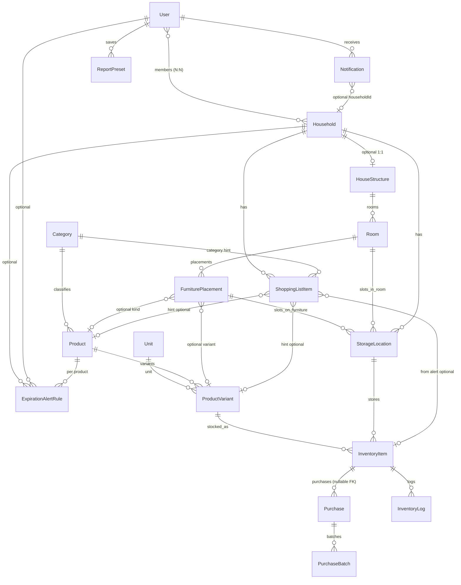

# ER 다이어그램 & 엔티티 명세 v2 (Home Inventory Manager)

**버전**: v2 — 프론트 구현 피드백 반영 (2026-03-26)

**v1 대비 주요 변경**:
- Consumption, WasteRecord 엔티티 제거 → InventoryLog로 통합
- ShoppingList 엔티티 제거 → ShoppingListItem이 Household에 직접 연결
- Household에 `kind` 속성 추가
- HouseStructure에 `diagramLayout` 속성 추가
- FurniturePlacement에 `anchorDirectStorageId` 추가
- Purchase.inventoryItemId nullable, supplierName 추가
- ShoppingListItem에 `targetStorageLocationId` 추가
- Notification에 `householdId` 추가
- 변경 근거: [frontend-backend-alignment.md](../backend/docs/frontend-backend-alignment.md) §1 참조

**v1 원본**: [v1/er-diagram.md](../v1/er-diagram.md)
상세 필드는 [엔티티 논리적 설계 v2](./entity-logical-design.md), 개념만 보려면 [개념적 설계 v2](./entity-conceptual-design.md)를 참고하세요.

---

## 1. 엔티티 목록

| 순번 | 엔티티              | 핵심 역할                                                                  | 주요 관계                            | 우선순위 | v2 변경 |
| ---- | ------------------- | -------------------------------------------------------------------------- | ------------------------------------ | -------- | ------- |
| 1    | User                | 사용자 계정                                                                | — (Household과 N:N)                  | P0       | — |
| 2    | Household           | 가족·공유 그룹                                                             | User ↔ ManyToMany                    | P0       | `kind` 추가 |
| 3    | Category            | 대분류 (식료품, 생활용품, 의약품 등) — 플랫(1단계)                         | —                                    | P0       | — |
| 4    | StorageLocation     | 보관 슬롯(방·가구 아래 최종 칸)                                            | Household, Room·FurniturePlacement   | P0       | — |
| 5    | Unit                | 단위 마스터 (ml, g, 개…)                                                   | —                                    | P1       | — |
| 6    | Product             | 상품 마스터 (소모품·비소모품)                                              | Category                             | P0       | — |
| 7    | ProductVariant      | 용량/포장 단위별 정보                                                      | Product                              | P0       | — |
| 8    | InventoryItem       | 실제 보유 재고(물품)                                                       | ProductVariant, StorageLocation      | P0       | — |
| 9    | Purchase            | 구매 기록                                                                  | InventoryItem (nullable)             | P0       | `inventoryItemId` nullable, `supplierName` 추가 |
| 10   | PurchaseBatch       | 로트별 유통기한                                                            | Purchase                             | P0       | — |
| 11   | InventoryLog        | 재고 변경 이력 (**소비·폐기 통합**)                                        | InventoryItem                        | P0       | **Consumption·WasteRecord 통합**, `reason`·`itemLabel` 추가 |
| 12   | ShoppingListItem    | 장보기 항목 (**Household 직접 연결**)                                      | Household, Category                  | P1       | **ShoppingList 제거**, `householdId` FK, `targetStorageLocationId` 추가 |
| 13   | Notification        | 알림                                                                       | User, Household                      | P1       | `householdId` 추가 |
| 14   | ExpirationAlertRule | 만료 알림 설정(품목별 일수)                                                | User 또는 Household, Product         | P1       | — |
| 15   | ReportPreset        | 리포트 설정 저장                                                           | User                                 | P3       | — |
| 16   | HouseStructure      | 집 구조 — 방·슬롯 정의(JSONB)                                              | Household 1:1                        | P1       | `diagramLayout` 추가 |
| 17   | Room                | 집 구조 내 방                                                              | HouseStructure                       | P1       | — |
| 18   | FurniturePlacement  | 방 안 가구 배치(인스턴스)                                                  | Room                                 | P1       | `anchorDirectStorageId` 추가 |

### v2에서 제거된 엔티티

| 엔티티 | 사유 | 대체 |
|--------|------|------|
| ~~Consumption~~ | InventoryLog(type='out')로 통합 | InventoryLog §14 |
| ~~WasteRecord~~ | InventoryLog(type='waste' + reason)로 통합 | InventoryLog §14 |
| ~~ShoppingList~~ | 프론트에 부모 리스트 개념 없음. ShoppingListItem이 Household에 직접 연결 | ShoppingListItem §15 |

### User ↔ Household (다대다)

- 중간 테이블 `HouseholdMember`로 멤버십·역할(소유자/멤버) 관리.

---

## 2. 관계 요약 (텍스트)

```
Household (가족·공유 그룹)
  ├── HouseStructure (1:1, 선택) — 집 구조(방·슬롯 JSON + diagramLayout)
  │     └── Room (1:N) — 방 엔티티(structureRoomKey ↔ JSON)
  │           ├── FurniturePlacement (1:N) — 가구 배치(인스턴스, anchorDirectStorageId)
  │           │     └── StorageLocation (1:N) — 그 가구 위·안 보관 슬롯
  │           └── StorageLocation (1:N) — 방 직속 슬롯(냉장고 등)
  ├── StorageLocation (1:N) — 구조 미연동·레거시 장소도 가능
  ├── ShoppingListItem (1:N) — 장보기 항목 (v2: Household 직접 연결)
  └── ExpirationAlertRule (1:N, 선택)

User
  ├── Household (N:N)
  ├── Notification (1:N)
  ├── ExpirationAlertRule (1:N, 선택, 품목별)
  └── ReportPreset (1:N)

Category
  ├── Product (1:N)  ※ 플랫 카테고리(계층 없음)
  └── ShoppingListItem (1:N, 장보기 줄 분류 기준)

Product
  ├── ProductVariant (1:N)
  ├── ExpirationAlertRule (1:N, 선택, 품목별 일수)
  └── ShoppingListItem (선택 힌트)

ProductVariant
  ├── InventoryItem (1:N)
  └── ShoppingListItem (선택 힌트)

InventoryItem
  ├── Purchase (1:N) — v2: nullable FK
  ├── InventoryLog (1:N) — v2: 소비·폐기 통합
  └── ShoppingListItem (선택: 알림 출처 ref)

Purchase
  └── PurchaseBatch (1:N)
```

---

## 3. Mermaid ER 다이어그램 (개념도)



---

## 4. 유지보수

- 엔티티 추가·변경 시 **이 파일**과 [논리적 설계 v2](./entity-logical-design.md)를 함께 수정합니다.
- v1 원본은 [v1/](../v1/) 폴더에 보존되어 있습니다.

---

*본 문서는 [frontend-backend-alignment.md](../backend/docs/frontend-backend-alignment.md) §1 결정에 따라 v1에서 갱신되었습니다.*
